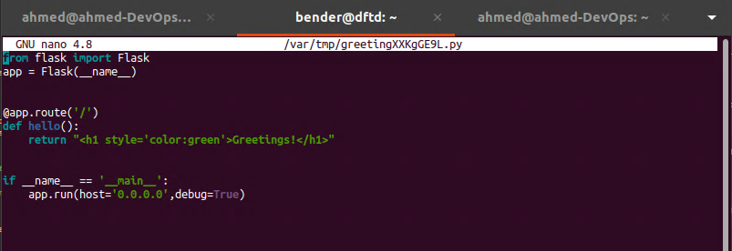

This is writeup of a series of 3 parts writeup of a Homelab i did to acquire and practice DevOps. The Github repository of the source code and configuration files i used in this project can be found in the Link above this paragraph.

You can find the other parts by navigating my blog through the **Projects** tab or by following the links below:

- Part 1: You are here now.
- Part 2: https://ahmouden.com/projects/devops-homelab-part-2
- Part 3: https://ahmouden.com/projects/devops-homelab-part-3

Part 1 will cover the following:
- Setting up a virtual machine
- Using Ansible to manage passwords, users, and groups
- Using Ansible to configure SSH
- Controlling user commands with sudo
- Automating and testing a host-based firewall


# 1 - Setting up a virtual machine

**Provisioning** a virtual machine (VM) means **setting up** a VM. Provisioning a VM means creating it, and then configuring it. For that we'll use two tools. Vagrant will build the VM and Ansible will configure it. 

Vagrant automates the process of creating the VM. And once it is running, Ansible configures it.

Vagrant and Ansible are categorized as Infrastructure as Code. Using code to build and provision infrastructure is a consistent, quick, and efficient way to manage and deploy applications. It allows for the infrastructure to scale, reduces operating costs, decreases time for recovery during a disater, and minimizes the chance of configuration mistakes.

Infrastructure as Code (IaC): treating infrastructure as code is the process of using code to describe and manage infrastructure like VMs, cloud resources, etc.

Configuration Management (CM): is the process of configuring thoses resources for a specific purpose in a predictable, repeatable manner.

- Vagrant -> IaC
- Ansible -> CM

## Intro to Vargrant

Vagrant is a tool to create and manage VMs. As mentionned before, Vagrant is considered a IaC tool. Vagrant uses a single configuration file `Vagrantfile` to describe the infrastructure or virtual environment you want built in code, and Vagrant will build it.

### Installation

The official download link:
```
https://developer.hashicorp.com/vagrant/install
```
Installing it using the `apt` package manager:
```bash
wget -O - https://apt.releases.hashicorp.com/gpg | sudo gpg --dearmor -o /usr/share/keyrings/hashicorp-archive-keyring.gpg
echo "deb [arch=$(dpkg --print-architecture) signed-by=/usr/share/keyrings/hashicorp-archive-keyring.gpg] https://apt.releases.hashicorp.com $(lsb_release -cs) main" | sudo tee /etc/apt/sources.list.d/hashicorp.list
sudo apt update && sudo apt install vagrant
```

The version i'm working with during this project is `Vagrant 2.4.1`:


One more thing we need to install is `vbguest`. `vbguest` is a Vagrant plugin which automatically installs the host's VirtualBox Guest Additions on the guest system. [Official github page](https://github.com/dotless-de/vagrant-vbguest).

```bash
ahmed@ahmed-DevOps:~$ vagrant plugin install vagrant-vbguest
==> vagrant: A new version of Vagrant is available: 2.4.3 (installed version: 2.4.1)!
==> vagrant: To upgrade visit: https://www.vagrantup.com/downloads.html

Installing the 'vagrant-vbguest' plugin. This can take a few minutes...
Installed the plugin 'vagrant-vbguest (0.32.0)'!
```

### Anatomy of a `Vagrantfile`

- A `Vagrantfile` describes how to build and provision a VM
- Use one `Vagrantfile` per project so version control becomes easier and anyone can replicate the project infrastructure on their machine
- `Vagrantfile` uses Ruby

#### OS
Vagrant needs to know which OS the VM he is going to build will be running. Vagrant calls it a different name though, a **Vagrant Box**. Vagrant has a public registry of public boxes anyone can use: [https://portal.cloud.hashicorp.com/vagrant/discover](https://portal.cloud.hashicorp.com/vagrant/discover).

```ruby
config.vm.box = "ubuntu/focal64"
```

`ubuntu` is the Ubuntu registry for Vagrant boxes, and `focal64` is the name of the box Vagrant will use.

#### Networking
We can configure the VM's network options to use a static IP or to get one from a DHCP.

We want the machine to be accessible for us, but not publicaly accessible from the global internet. Vagrant private networks provide this by assigning an address from the private address space to the VM.

The easiest way to use a private network is to allow the IP to be assigned via DHCP:

```ruby
Vagrant.configure("2") do |config|
  config.vm.network "private_network", type: "dhcp"
end
```

Or if we need to assign a static IP to the VM, we can do the following:

> [!WARNING]
> Make sure the static IP is unique and no other machine has the same IP, because it will make it **unreachable**

```ruby
Vagrant.configure("2") do |config|
  config.vm.network "private_network", ip: "192.168.50.4"
end
```

We can choose any IP we want for the machine, but we should pick an IP from the private address space. Here is why:
- Private IPs are **guaranteed** to never be publicaly routable
- Routers block traffic from going to them from the outside


For this project, We are going with a dynamic IP for easy assignement:

```ruby
config.vm.network "private_network", type: "dhcp"
```

#### Providers

**Providers** are plug-ins that know how to create and manage a VM. Vagrant supports for **VirtualBox** (which we are using in this project), **Hyper-V**, and **Docker** out of the box. Before you use any provider (that doesn't come with Vagrant), you must install it first using the **Vagrant plugin system**.

Vagrant uses the provider's API to create and manage the VM. Things like the CPU, disk, and memory.

The Vagrant providers documentation: [https://developer.hashicorp.com/vagrant/docs/providers](https://developer.hashicorp.com/vagrant/docs/providers)

- Vagrant boxes are all **provider-specific**
- A box for VirtualBox is incompatible with the VMware Fusion provider or any other provider
- We can't have two boxes with the same name for the same provider, but boxes for different providers can share the same name

For now we should just know is that a provider, for example a VirtualBox provider, is capable of modifying the VM options and configurations.

the provider section in the `Vagrantfile` would like like this:

```ruby
config.vm.provider "virtualbox" do |vb|
 vb.memory = "1024"
 vb.name = "dftd"
 --snip--
end
```

`vb.name` customizes the name of the VM when it appears in the VirtualBox GUI (that is disabled by default btw).

`vb.memory` sets the amount of RAM available to the VM.

#### Basic Vagrant Commands

- `vagrant up`: create a VM based on the `Vagrantfile`
- `vagrant destroy`: destroy the running VM
- `vagrant status`: show status of a running VM
- `vagrant ssh`: SSH into a VM

> [!TIP]
> add `--help` flag to each of the commands above for even more options.


## Intro to Ansible

Ansible is a **Configuration Management** tool that can orchestrate the provisioning of infrastructure like VMs. Ansible uses a **declarative configuration style** which means describing the desired state and Ansible will take care of getting there.

Ansible takes YAML files as input. Ansible uses **SSH** to apply its configuration, so that means SSH must be enabled and accessible by Ansible for it to work.

### Installation

>Official installaion link:
[https://docs.ansible.com/ansible/latest/installation_guide/intro_installation.html](https://docs.ansible.com/ansible/latest/installation_guide/intro_installation.html)


Before using Ansible or even reading the documentation, we should first understand common concepts Ansible is based on.

> Basic concepts documentation: [https://docs.ansible.com/ansible/latest/getting_started/basic_concepts.html](https://docs.ansible.com/ansible/latest/getting_started/basic_concepts.html)

- **Control node**  
  The machine from which you run the Ansible CLI tools (ansible-playbook, ansible, ansible-vault, and others). You can use any computer that meets the software requirements as a control node. Multiple control nodes are possible, but Ansible itself does not coordinate across them.

- **Managed nodes**  
  Also referred to as ‘hosts’, these are the target devices (servers, network appliances, or any computer) you aim to manage with Ansible. Ansible is not normally installed on managed nodes, unless you are using ansible-pull.

- **Inventory**  
  A list of managed nodes provided by one or more ‘inventory sources’. Your inventory can specify information specific to each node, like IP address, and is also used for assigning groups, which allow for node selection in the Play and bulk variable assignment.

- **Playbooks**  
  Files written in YAML that contain Plays (the basic unit of Ansible execution). Playbooks are easy to read, write, share, and understand.

- **Plays**  
  The main context for Ansible execution. This object maps managed nodes (hosts) to tasks, containing variables, roles, and an ordered list of tasks. It defines how to iterate over them.

- **Roles**  
  A limited distribution of reusable Ansible content (tasks, handlers, variables, plugins, templates, and files) for use inside a Play. The Role must be imported into the Play.

- **Tasks**  
  The definition of an ‘action’ to be applied to the managed host. Tasks can be executed with ad hoc commands using ansible or ansible-console.

- **Handlers**  
  A special form of a Task that only executes when notified by a previous task that resulted in a ‘changed’ status.

- **Modules**  
  The code or binaries Ansible copies to and executes on each managed node to accomplish the action defined in each Task. Modules are grouped in collections.

- **Plugins**  
  Pieces of code that expand Ansible’s core capabilities, including connection plugins, filter plugins, and callback plugins.

- **Collections**  
  A format in which Ansible content (including playbooks, roles, modules, and plugins) is distributed. Collections can be installed and used through Ansible Galaxy. They can be used independently and discretely from each other.


### Ansible Playbook

We can think of a playbook as an instruction manual on how to assemble a host. As mentionned before, Ansible understands YAML files. Normally we would create one main YAML file that imports other YAML files inside folders that represent different things. But before all of that let's learn a bit more on what goes inside the playbook YAML files.

All playbooks needs a header that contains global variables. `name` to give a name to the play. `hosts` to specify the target hosts of the playbook. It can be a single host, an IP address, a groups of hosts, a wildcard, or `all` hosts. By using `all` we don't need to keep track of the VMs created by Vagrant since they are all targets of the playbook.

As you know some commands require escalated privileges. Privileges escalation is disactivated by default in Ansible. `become` activates them by setting it to `true`. After activating them, we need to "become" the root user or the user with the privileges. For most distros the user is `root`, but for Ubuntu the user is `ubuntu`. `become_user` specifies the user we want to **become** to execute the tasks with escalated privileges. `become_method` is the command we'll be used to **become** the privileged user. 

`remote_user` also exists and can be confused with `become_user`. `remote_user` is the user who logs in, and the `become_user` is the user who executes the tasks.

My ansible files will be inside an `ansible` directory. The main playbook is `site.yml`:

```yaml
---
- name: Provision VM
  hosts: all
  become: yes
  become_method: sudo
  remote_user: ubuntu
```

- Give each play a name to make it easy to find and debug them in the future
- Set `hosts` to `all` to match any VMs built by Vagrant. Vagrant autogenerates the Ansible inventory file when it builds a new VM
- `become_user` wasn't used here because we are logged in (`remote_user`) as `Ubuntu` the default user with escalated privileges

 The next section is where we list the tasks the host will be executing. This is where the real work is being done. The `tasks` sections looks like this:

 ```yaml
 --SNIP--
 remote_user: ubuntu
 tasks:
 #- import_tasks: chapter2/pam_pwquality.yml
 #- import_tasks: chapter2/user_and_group.yml
 --SNIP
 ```

 `import_tasks` is a function to import tasks from external files. It helps with organization the plays and is considered a best practice.

 ### Basic Ansible Commands

Multiple commands exist in the Ansible application. `ansible` and `ansible-playbook` are the most common ones.

- `ansible`: running ad hoc (one-time) commands.
- `ansible-playbook`: runs playbooks. Vagrant actually uses this command during the provisioning phase.

Examples: 

Instruct a group of webservers to restart nginx. The `--become` flag is used here to ask for privilege escalation.
```sh
ansible webservers -m service -a "name=nginx state=restarted" --become
```

Run the `aws-cloudwatch.yml` playbook against the `dockerhosts` group of hosts. If a group is not specified, then Ansible assumes you want to run the playbook on all hosts in the inventory file.
```sh
ansible-playbook -l dockerhosts aws-cloudwatch.yml
```

## Creating an Ubuntu VM

Let's get some infrastructure up!

We'll use Vagrant to create the Ubuntu VM created then call Ansible to provision it. We need to be in the same directory as the `Vagrantfile`, then use the command `vagrant up`.

The `vagrant up` output will tell us three things:
- The base image getting downloaded (or it's already downloaded and ready)
- Configuring the network interfaces and setting up SSH
- Mounting the shared folder between the host machine (the one with Vagrant) and the VM (created by Vagrant)

```sh
vagrant up
```


Since I already provisioned the VM, the `provisioner` part is missing in the output. The `--provision` flag needs to be added to force provisioning.

```sh
# shutdown the VM first
vagrant halt
# create the VM and provision it. --provision flag to force provisioning
vagrant up --provision
```


> [!WARNING]
> In case the Vagrant gets stuck at `SSH auth method: private key`. Then one of the reasons is you are probably using WSL in your windows host machine and you need to disable the Windows `VirtualMachinePlatform` feature. [Source](https://github.com/hashicorp/vagrant/issues/11987)


Great! Now we have the provisioning output. We can see that the provisioner Vagrant is using is Ansible, and the command used is `ansible-playbook`.

```ruby
==> default: Running provisioner: ansible...
    default: Running ansible-playbook...
```

Here we see the `ansible-playbook` output. It keeps track of all the tasks and what was chaned on the host. In our playbook's play `Provision VM` there is not task to be ran, so no changes are expected. And we can see that in the output's `changed=0` log.

```ruby
PLAY [Provision VM] ************************************************************

TASK [Gathering Facts] *********************************************************
ok: [default]

PLAY RECAP *********************************************************************
default                    : ok=1    changed=0    unreachable=0    failed=0    skipped=0    rescued=0    ignored=0   
```

To check your running VMs use the `vagrant status` command:

```sh
vagrant status
```


# 2 - Using Ansible To Manage Passwords, Users, And Groups

In this part I'll talk about how to:
- Enforce a complex password policy
- Manage users
- Manage groups
- Update the VM
- Test user and group permissions

## Enforcing Complex Password Policies

Trusting users to decide what a strong password is isn't very smart. We need to enforce complex strong passwords on every host users have access to. And since this is a DevOps project, we'll automate this using code.

Most Linux distributions use **Pluggable Authentication Modules (PAM)** to handle everything related to user authentication. An application can delegate user authentication to the PAM API instead of developing its own authentication logic which will take time and not be as mature and secure as what PAM offers.

PAM is a big and complex system (I'm planning to write a blog post about it), but what you need to know is that there are modules that take care of the accounts, their authentication, the sessions, and the passwords. Since we want to enforce complex passwords, we are interested in a password module called `pam_pwquality` that puts conditions(length, use of special characters, numbers, etc ) on what is an acceptable password.

PAM as its name says uses *pluggable* modules, which means we can install modules if we don't have them on the machine. The module `pam_pwquality` can be installed using the `libpam-pwquality` package. Our goal is to automate administritive tasks. We'll use two Ansible tasks, one to install the module, and the other to configure it.

### First Task: installing the PAM module 

The first task we'll be writing is about installing the module. Let's break it down:
- `---` The three dashes are used to signal the start of a document. It is a good practice to always start our documents with them in case there are directives before or after our document.
- `name` Each task needs to have a name to describe what it does.
- `package` This built-in Ansible module is a **generic** OS package manager. It has 3 parameters, 2 are required. `name` to specify the package name. `state` to specify the package state that you want: `present` to install the package, `absent` to remove the package, `latest` to install the latest version.

We need the `libpam-pwquality` package installed (state `present`):

```yaml
---
- name: Install libpam-pwquality
  package:
    name: "libpam-pwquality"
    state: present
```

> [!WARNING]
> If you use a task to install a package and the package gets installed and then you remove the task, the package will still be installed. You need to **explicitly** state that you want it removed.


Ansible modules (like the `package` module) perform common actions on an OS (managing users, firewalls, installing/removing software, etc). 

Ansible actions are **idempotent** which means no matter how much the actions are repeated they will have the same result. This is important because it enables consistency with our configuration management.

### Second Task: configuring the module to enforce a stricter password policy

The default Ubuntu password policy is not strong. The password policy works by performing complexity checks on the password like the length of the password, the use of special characters, numbers, uppercase, lowercase, etc

As we said before, Ubuntu uses PAM for authentication. When a user tries to authenticate by entering his username and password, It is the PAM configuration file `common-password` that takes cares of the password security including enforcing password complexity, and It is the `pam-pwquality` module enforcing the policy. 

By default the password policy is located in the `/etc/security/pwquality.conf` configuration file.
And here is its entry in the `common-password` file:

```
password	requisite			pam_pwquality.so retry=3
```
The weak default password policy will be enforced. `retry` is the number of times the user will get prompted to enter the password before returning an error.

The strong password policy we want is:
- `minlen=12`: minimum length of 12 characters
- `lcredit=-1` minimum of 1 lowercase character
- `ucredit=-1` minimum of 1 uppercase character
- `dcredit=-1` minimum of 1 digit character
- `ocredit=-1` minimum of 1 other (AKA special) character
- `enforce_for_root` by default root can set any password he wants, but this enforces the policy

You might be wondering why the credit arguments that are `-1` mean a minimum of `1`. It has something to do with a credits system `pwquality.conf` uses to encourage users to choose stronger passwords.

> To understand the credit system used in the `pwquality.conf` file
> https://unix.stackexchange.com/questions/777218/how-does-the-credit-system-work-in-pam-pwquality

Now we know that these are the arguments we want to give to the `pam_pwquality.so` module.

```yaml
password required pam_pwquality.so minlen=12 lcredit=-1 ucredit=-1 dcredit=-1 ocredit=-1 retry=3 enforce_for_root
``` 

What is left is to automate it in an Ansible task. We want the task to edit the `common-password` file and replace the default line with the new line with the extra arguments. The Ansible `lineinfile` module manages lines in text files. It can be used to insert, replace, or remove lines in a text file. `path` to specify the path of the text file we want to edit. `regexp` specifies the regular expression to find the line we want edited. `line` specifies the value wa want to use. `state=present` tells Ansible to replace the last `regexp` match with the value of `line`. 

```yaml
--snip--
- name: Configure pam_pwquality
  lineinfile:
    path: "/etc/pam.d/common-password"
    regexp: "pam_pwquality.so"
    line: "password required pam_pwquality.so minlen=12 lcredit=-1 ucredit=-1 dcredit=-1 ocredit=-1 retry=3 enforce_for_root"
    state: present
  --snip--
```


## Linux Users

A user in linux can be associated with a username, password, group. Three types of users:
- *normal* users, like a human accounts. UID between `1000` to `65533` and `65536` to `4294967294`.
- system users, non-human accounts. UID between `1` and `999`.
- root. UID is always `0`.

> Learn more here
> 
> https://systemd.io/UIDS-GIDS/

### The Ansible User Module
The `user` module manages user accounts and their attributes, like shells, keys, groups, passwords, home directories, etc.

Here is what we need to do in 5 tasks:
- create `developers` group
- create `bender` user with a shell of `bash` and a pre-determined password
- `bender` is a member of `developers`
- create directory `engineering` in `/opt/` owned by `developers` group
- create a file `private.txt` in the `/opt/engineering/` directory, both owned by `developers` group

The `user` module has multiple parameters to control the user account and its attributes. The `name` of the user is `bender`. `shell` to set the user's shell to `/bin/bash`. And if we want to set the user password, the `password` parameter is used with the value of the **encrypted hash** of the password.

> The `user` module documentation
> 
> https://docs.ansible.com/ansible/latest/collections/ansible/builtin/user_module.html

There are two tools that can help us with the password. `pwgen` can generate secure passwords, and `mkpasswd` can turn the secured password into an SHA-512 encrypted hash that linux accepts.

```sh
sudo apt update
sudo apt install pwgen whois
pass=`pwgen --secure --capitalize --numerals --symbols 12 1`
echo $pass | mkpasswd --stdin --method=sha-512; echo $pass
```

```sh
ahmed@ahmed-DevOps:~$ pass=`pwgen --secure --capitalize --numerals --symbols 12 1`
ahmed@ahmed-DevOps:~$ 
ahmed@ahmed-DevOps:~$ echo $pass | mkpasswd --stdin --method=sha-512; echo $pass
$6$Q0mwMluF$i6YxCcRkIw0ut0wNr3F97ck02xmYjxOdMj2zo4g4fHKPEKjzW95hSs08I92RiZ3AkoOm/QcgsjHcs4emC7mGE1
)J]U9on6{jVb
ahmed@ahmed-DevOps:~$ 
```

> [!CAUTION]
> Do not store credentials or sensitive information (like password hashes) in insecure places (like an Ansible playbook). Use Ansible Vault to store secrets for example.

And here is our Ansible task ready.

```yaml
- name: Create the user 'bender'
  user:
    name: bender
    shell: /bin/bash
    password: $6$Q0mwMluF$i6YxCcRkIw0ut0wNr3F97ck02xmYjxOdMj2zo4g4fHKPEKjzW95hSs08I92RiZ3AkoOm/QcgsjHcs4emC7mGE1
```

## Linux Groups
Linux groups are used for organization puproses, mainly to group users together and easily administer and manage their access to resources (like a certain directory or file).

### The Ansible Group Module
The Ansible `group` module is used to manage the presence (creation or removal) of groups on a host. It has 9 parameters, and `name` is the only required one. Since we want the group `developers` created then we'll specify the `name` to `developers` and `state` to `present` and Ansible will make sure the group is created.

```yaml
- name: Ensure group 'developers' exists
  group:
    name: developers
    state: present
```

### Assigning a User to the Group

Now that the group is created, let's add the user `bender` to it. We'll use the `user` module to do that. 

In linux a user account has **one primary group** and then any number of **secondary groups**. When a user is created in Linux using the `useradd` command a group with the same name as the user is also created and assigned to the user as his primary group.

In the `user` Ansible module, there are two parameters corresponding to a user's primary group and secondary groups: `group` for setting the primary group, and `groups` (with an `s`) for the secondary groups.

To append a user to a group we need to tell Ansible that by using the `append` parameter with a `true` value to add the user to the groups specified in `groups`.

> [!WARNING]
> The default value for `append` is `false`, which means the user will be removed from all groups expect its primary group and the groups stated in `groups`.

```yaml
- name: Assign 'bender' to the 'developers' group
  user:
    name: bender
    groups: developers
    append: yes
```

### Creating Protected Resources
Last thing we need to do is to create a directory and a file inside of it both owned by the `developers` group. Let's start with the directory creation first.

Everything in Linux is a file, so a directory is also a file. Every file has permissions, and every file has an owner.

We are creating the `engineering` directory in the `path` of `/opt/engineering`. Ansible uses the `state` parameter to know which type of file you want to create. The `state` will be `directory`. `mode` sets the permissions of the file by using the octal format (`644`) of the permissions. Ansible also supports the symbolic format (`u+rwx` or `u=rw,g=r,o=r`) of the permissions.

We'll give the directory the `mode` `0750`, which means the owner user (root in our case) will have R/W/X rights, the owner group to have R/X rights (X (execute) permission is needed with directories to be able to enter and list them), and the others have no rights which means no access.

> We can use this application to calculate the modes: 
>
> https://chmod-calculator.com/


Great now we can write the Ansible task:

```yaml
- name: Create a directory named 'engineering'
  file:
    path: /opt/engineering
    state: directory
    mode: 0750
    group: developers
```

And the last Ansible task is going to create the a file inside the `engineering` directory called `private.txt`. The idea behind this directory and file is to smoke test restricting access to resources to a specific group (`developers`).

Same with a directory, the `file` module is used and the owner `group` is `developers`, but the three differences are:
- the `path` is inside the directory `/opt/engineering/private.txt`
- the `state` is `touch` to create an empty file
- the `mode` is `0770` to give the owner user and owner group full rights (R/W/X)
 
 ```yaml
 - name: Create a file in the engineering directory
  file:
    path: "/opt/engineering/private.txt"
    state: touch
    mode: 0770
    group: developers
 ```

Now all the tasks are ready, but one final thing to keep in mind is that the order of the tasks is important and needs to be logical. For example you can't tell Ansible to create a file in a directory that doesn't exist yet. 

Here are the tasks we wrote so far. The first two tasks are related to PAM and password enforcement, and the rest of the tasks are related to user, group, and file management. The tasks will be put in two files, inside a directory called `system_administration`

 ## Updating the VM

Make the Vagrant VM is up first:
```sh
ahmed@ahmed-DevOps:~/devops/vagrant$ vagrant up
==> vagrant: A new version of Vagrant is available: 2.4.3 (installed version: 2.4.1)!
==> vagrant: To upgrade visit: https://www.vagrantup.com/downloads.html

Bringing machine 'default' up with 'virtualbox' provider...
==> default: Checking if box 'ubuntu/focal64' version '20240821.0.1' is up to date...
==> default: Clearing any previously set forwarded ports...
==> default: Clearing any previously set network interfaces...
==> default: Preparing network interfaces based on configuration...
    default: Adapter 1: nat
    default: Adapter 2: hostonly
==> default: Forwarding ports...
    default: 22 (guest) => 2222 (host) (adapter 1)
==> default: Running 'pre-boot' VM customizations...
==> default: Booting VM...
==> default: Waiting for machine to boot. This may take a few minutes...
    default: SSH address: 127.0.0.1:2222
    default: SSH username: vagrant
    default: SSH auth method: private key
    default: Warning: Connection reset. Retrying...
==> default: Machine booted and ready!
[default] GuestAdditions 6.1.50 running --- OK.
==> default: Checking for guest additions in VM...
==> default: Setting hostname...
==> default: Configuring and enabling network interfaces...
==> default: Mounting shared folders...
    default: /vagrant => /home/ahmed/devops/vagrant
==> default: Machine already provisioned. Run `vagrant provision` or use the `--provision`
==> default: flag to force provisioning. Provisioners marked to run always will still run.
```

In the main Ansible playbook, we need to import the two task files. Here is the main play for now:

```yaml
ahmed@ahmed-DevOps:~/devops/ansible$ cat site.yml 
---
- name: Provision VM
  hosts: all
  become: yes
  become_method: sudo
  remote_user: ubuntu
  tasks:
      - import_tasks: system_administration/pam_pwquality.yml
      - import_tasks: system_administration/user_and_group.yml
```

What left is to let Ansible do its job in provisioning the VM. We can do that by using the command

```sh
ahmed@ahmed-DevOps:~/devops/vagrant$ vagrant provision
==> default: Running provisioner: ansible...
    default: Running ansible-playbook...

PLAY [Provision VM] ************************************************************

TASK [Gathering Facts] *********************************************************
ok: [default]

TASK [Install libpam-pwquality] ************************************************
changed: [default]

TASK [Configure pam_pwquality] *************************************************
changed: [default]

TASK [Ensure group 'developers' exists] ****************************************
changed: [default]

TASK [Create the user 'bender'] ************************************************
changed: [default]

TASK [Assign 'bender' to the 'developers' group] *******************************
changed: [default]

TASK [Create a directory named 'engineering'] **********************************
changed: [default]

TASK [Create a file in the engineering directory] ******************************
changed: [default]

PLAY RECAP *********************************************************************
default                    : ok=8    changed=7    unreachable=0    failed=0    skipped=0    rescued=0    ignored=0   
```

`8` tasks performed and `7` changes on the VM. Let's verify by login in to the VM and checking the new user and the directory and private file inside it.

```sh
ahmed@ahmed-DevOps:~/devops/vagrant$ vagrant ssh
vagrant@dftd:~$
```

The `vagrant` user is the default user Vagrant creates in its VMs. We can use the `getent` command (stands for **get entry**) to find entries of a keyword in multiple databases (like `passwd` and `shadow`).

```sh
vagrant@dftd:~$ getent --usage
Usage: getent [-i?V] [-s CONFIG] [--no-idn] [--service=CONFIG] [--help]
            [--usage] [--version] database [key ...]
vagrant@dftd:~$ getent passwd bender
bender:x:1002:1003::/home/bender:/bin/bash
vagrant@dftd:~$ getent group bender
bender:x:1003:
```

Now let's verify the `developers` group

```sh
vagrant@dftd:~$ getent group developers
developers:x:1002:bender
```

Now let's verify the permissions on the `engineering` directory and the `private.txt` file. members of the `developers` groups should be the only ones with access to them. Let's test it first with a non-member user the `vagrant` user:

```sh
vagrant@dftd:/opt$ pwd
/opt
vagrant@dftd:/opt$ ls -al
total 16
drwxr-xr-x  4 root root       4096 Jan 17 01:06 .
drwxr-xr-x 20 root root       4096 Jan 17 01:04 ..
drwxr-xr-x  8 root root       4096 Nov 16 19:39 VBoxGuestAdditions-6.1.50
drwxr-x---  2 root developers 4096 Jan 17 01:06 engineering
vagrant@dftd:/opt$ cd engineering/
-bash: cd: engineering/: Permission denied
vagrant@dftd:/opt$ ls engineering/
ls: cannot open directory 'engineering/': Permission denied
vagrant@dftd:/opt$ cat engineering/private.txt
cat: engineering/private.txt: Permission denied
```

Now with the `bender` user:

```sh
vagrant@dftd:/opt$ pwd 
/opt
vagrant@dftd:/opt$ sudo su - bender
bender@dftd:~$ cd /opt/
bender@dftd:/opt$ ls -al
total 16
drwxr-xr-x  4 root root       4096 Jan 17 01:06 .
drwxr-xr-x 20 root root       4096 Jan 17 01:04 ..
drwxr-xr-x  8 root root       4096 Nov 16 19:39 VBoxGuestAdditions-6.1.50
drwxr-x---  2 root developers 4096 Jan 17 01:06 engineering
bender@dftd:/opt$ cd engineering/
bender@dftd:/opt/engineering$ ls -al
total 8
drwxr-x--- 2 root developers 4096 Jan 17 01:06 .
drwxr-xr-x 4 root root       4096 Jan 17 01:06 ..
-rwxrwx--- 1 root developers    0 Jan 17 01:06 private.txt
bender@dftd:/opt/engineering$ cat private.txt 
bender@dftd:/opt/engineering$ echo "Hi" > private.txt 
bender@dftd:/opt/engineering$ cat private.txt 
Hi
```

It works!

We successfully provisioned the VM using Ansible.

# 3 - Using Ansible to Configure SSH

 SSH provides command line access to a remote machine from your machine. Misconfigurations and lack of understanding of SSH can lead to unauthorized access. We need to learn how to increase the security of SSH and automate it using Ansible.

 - We'll disable password access over SSH, but only require public key authentication over SSH
 - We'll enable 2FA over SSH for the user `bender`
 - We'll automate everything using Ansible

## Understanding and Activating Public Key Authentication

Linux use passwords to authenticate over SSH by default. Public key authentication is more secure because on top of needing to get hold of the private key, you also need to know the *passphrase* associated with the private key. 

The method is based on two keys, one public and one private. The remote host encrypts a *challenge* using the public key, then sends it to the host who wants to connect, the encrypted challenge can be decrypted by only by someone who has the private key, so the requesting host decrypts the challenge, and sends back a response to the remote host, which validates the response and confirms the identity of the requesting host and authenticates it.

### Generating a Public Key Pair
The command `ssh-keygen` is used to generate a key pair. It is part of the `ssh` package. We'll create a key pair and also attach a *passphrase* with the private key.

for the `ssh-keygen` command:
- `-t` Specifies the type of key to create.  The possible values are “dsa”, “ecdsa”, “ecdsa-sk”, “ed25519”, “ed25519-sk”, or “rsa”.

- `-f` specify the filname of the key pairs. Default name is `id_rsa`.
- `-C` to add a comment at the end of the key.

```sh
ahmed@ahmed-DevOps:~$ ssh-keygen -t rsa -f ~/.ssh/devops -C "DevOps Project"
Generating public/private rsa key pair.
Enter passphrase (empty for no passphrase): 
Enter same passphrase again: 
Your identification has been saved in /home/ahmed/.ssh/devops
Your public key has been saved in /home/ahmed/.ssh/devops.pub
The key fingerprint is:
SHA256:A51ABwSOOLvlfBKmFvF+B86QjvJLXyPwGN9j21Bpg/Q DevOps Project
The key's randomart image is:
+---[RSA 3072]----+
|    .+=..        |
| . o   + .       |
|o.. . o o        |
| oo .. + .       |
|..*+ .. E        |
| B=B+..o o       |
|+o*o=+B.         |
|oo +.+.*         |
|  o.. . .        |
+----[SHA256]-----+
ahmed@ahmed-DevOps:~$ cd .ssh/
ahmed@ahmed-DevOps:~/.ssh$ ls
devops  devops.pub
```

### Using Ansible to Get Your Public Key on the VM
The `authorized_keys` file in the `/home/<user>/.ssh/` directory of a user contains a list of public keys that are used to authenticate the user. In other words, in order for you to be able to authenticate to a remote host using a key pair, you need to place your public key in the `authorized_keys` file. That is what we are going to do using Ansible.

There is a module that can add or remove SSH authoirzed keys for users. It is the `authorized_key` module. It has 10 paramaters, 2 of which are required: `user` and `key`. Here are the parameters we are using for this Ansible task:
- `user` the username whose `authorized_keys` file will be modified
- `key` The SSH public key as a string
- `state` Whether the key should or shouldn't be in the file (default is `present`)

The user we want to login as is `bender`. We need the key to be present in the `authorized_keys` file, so `state` will be `present`. The `key` value needs to be a string, so we must read the contents of the SSH public key file (found in `~/.ssh/devops.pub`). Ansible provides a collection of **Plugin** that can access data from outside sources (*file*, databases, key/value stores, APIs, and other services). The plugins can be accessed by using the `lookup()` function.

There are multiple plugins, but I'll concentrate on what we are going to need in this task. We need a plugin to read the contents of a file. The `file` lookup plugin can do that, here is an example:

```yaml
vars:
  file_contents: "{{ lookup('file', 'path/to/file.txt') }}"
```

By the way, this operator `{{  }}` is called Ansible's evaluation expansion operator.

And to read the value of an environment variable use the `env` plugin:

```yaml
vars:
  env_home: "{{ lookup('env', 'HOME') }}"
```

To see a complete list of plugins you can use with the `lookup()` function, use this command:

```sh
ahmed@ahmed-DevOps:~$ ansible-doc -t lookup -l
[WARNING]: Collection splunk.es does not support Ansible version 2.12.10
[WARNING]: Collection ibm.qradar does not support Ansible version 2.12.10
--SNIP--                                                     
env                                               Read the value of environment variables                                                               
--SNIP--                                                                       
file                                              read file contents                                                                                    
```

> To learn more about Lookup Plugins
>
> https://docs.ansible.com/ansible/latest/plugins/lookup.html

We need to read the contents of the SSH public key to assign it to the `key` parameter. We can read the contents of a file using the `file` lookup plugin. We just need to the location of the file we want to read. The full path of the SSH public key we generated is `/home/ahmed/.ssh/devops.pub`. The lookup function then will be `{{ lookup('file', '/home/ahmed/.ssh/devops.pub') }}`.

The problem is the username is hardcoded to `ahmed`. But we can use an environment variable to dynamically set the username value. The `HOME` environment variable contains the path of home folder of the user you are currently logged in as.

```sh
ahmed@ahmed-DevOps:~$ env | grep HOME
HOME=/home/ahmed
```

We can use the lookup plugin `env` to read its value, and replace the hardcoded home path in the second argument of the first lookup function to this: `{{ lookup('file', lookup('env','HOME') + '/.ssh/devops.pub') }}`

And here is the Ansible task that add our SSH public key in the `authorized_keys` file on the VM:

```yaml
- name: Set authorized key file from local user
  authorized_key:
    user: bender 
    state: present
    key: "{{ lookup('file', lookup('env','HOME') + '/.ssh/devops.pub') }}"
```

> Learn more about the `authorized_keys` module
>
> https://docs.ansible.com/ansible/latest/collections/ansible/posix/authorized_key_module.html


## Adding Two-Factor Authentication

The principal of Defense In Depth teaches us that the more layers of security we add, the more obstacles an attacker needs to bypass, the greater the chances we get to detect an attack. Using public key authentication over SSH is considered as a security layer. The next layer to add is 2FA.

Basically 2FA is based on the user providing **two** out of three things:
- something you ***know***: password, pin
- something you ***have***: phone, usb key
- something you ***are***: fingerprint, voice, face

So the first factor is the private key and its password. The second factor we'll be adding is something we have, which is an application on your phone or machine to recieve **Time-based One-Time Password (TOTP)** tokens as a second step in the authentication process.

The **Google Authenticator** package (`libpam-google-authenticator`) will be used to configure the VM to use TOTP tokens for logging in. **OATH-Toolkit** can be used to generate TOTP tokens.

Let's configure our VM to use 2FA to log in. There are 6 steps, which means 6 Ansible tasks:

- Ensure the `libpam-google-authenticator` package is installed
- Copy the TOTP secret key file to the `bender` home directory
- Edit the `/etc/pam.d/sshd` PAM config file to disable password authentication
- Edit the `/etc/pam.d/sshd` PAM config file to configure SSH to use GoogleAuthenticator for login
- Edit the `/etc/ssh/sshd_config`, even tho the default is `yes`, but ensure that the line `ChallengeResponseAuthentication yes` is `present`
- Set the authentication methods for `bender`, `vagrant`, and `ubuntu`. (`bender` -> public key and 2FA authentication, `vagrant` and `ubuntu` -> only public key authentication)

### Installing Google Authenticator

Google Authenticator provides a two-step authentication procedure using one-time passcodes (OTP), initially standardized by the Initiative for Open Authentication (OATH). The authentication mechanism integrates into the Linux PAM system.

The `libpam-google-authenticator` package provides the client program `google-authenticator` and the PAM module `pam_google_authenticator.so`.

The Ansible task must make sure the package is installed. The `apt` module will be used along with the `update_cache` parameter ([`apt` docs](https://docs.ansible.com/ansible/latest/collections/ansible/builtin/apt_module.html#parameter-update_cache)) to update the packages caches to make sure to get the latest version of the package. The default value for `update_cache` is `false`.

The default value for `state` is `present` but it is always a good practice to be explicit so other engineers know what you want the code to do.

```yaml
- name: Install the libpam-google-authenticator package
  apt:
    name: "libpam-google-authenticator"
    update_cache: yes
    state: present
```

### Configuring Google Authenticator

Now that we have the package installed, we need to configure the Google Authenticator. Every user who wants to use 2FA needs to generate a secret key file in their home directory. The secret key file contains a secret key, a verification code, and a list of emeregncy tokens.

```sh
# -f, --force Write: secret key and settings without first confirming with user.
# -t, --time-based: Set up time-based verification.
# -D, --allow-reuse: allow multiple uses of the same authentication token.
# -d, --disallow-reuse: Disallow multiple uses of the same authentication token.
# -r 3: No more than 3 login attempts
# -R 30: you can repeat login attempt after 30 seconds
## => -r 3 -R 30: no more that 3 login attempts every 30 seconds
# -w, --window-size=W: Set window of concurrently valid codes.
## In case of time skew (or time desynchronization) between the client and server, for instance the client is ahead (or behind) the server, when a token is generated in the client side, then sent to the server, the server rejects it because of the time difference and the default window of accepted tokens. The default is 3 tokens, max is 17. A window of 17 gives the client 4 minutes of valid tokens.
# -e, --emergency-codes=N: Generate N emergency codes. A maximum of 10 emergency codes can be generated.
ahmed@ahmed-DevOps:~$ google-authenticator -f -t -d -r 3 -R 30 -w 17 -e 10
Your new secret key is: H543XQRJR23QQPN2EMC4XKWEWM
Your verification code is 279903
Your emergency scratch codes are:
  92451444
  33639786
  17080098
  26208355
  84819846
  62385968
  76994219
  34463832
  17656962
  38269147
ahmed@ahmed-DevOps:~$ cat .google_authenticator 
H543XQRJR23QQPN2EMC4XKWEWM
" RATE_LIMIT 3 30
" WINDOW_SIZE 17
" DISALLOW_REUSE
" TOTP_AUTH
92451444
33639786
17080098
26208355
84819846
62385968
76994219
34463832
17656962
38269147
```

The `.google_authenticator` is the secret key file the we need to copy to the VM. Every user gets its own `.google_authenticator` configuration file in the user's `home/` directory.

> [!CAUTION]
> Secrets need to be stored in secure locations. For example use Ansible Vault or Hashicorp Vault to store the secrets.

The second Ansible task will copy the configuration file to the `bender`'s home directory.

We'll be using the `copy` module. It can copy a file or a directory from the local or remote machine to a location on the remote machine.

- `src` local path to a file to copy to the remote server. If it's a directory and ends with `/` it will copy only the contents of the directory, and if it doesn't end with `/`, then the directory and its contents are copied.
- `dest` the only required parameter. remote absolute path where the file should be copied to. The destination for the Google Authenticator configuration file needs to be in the `bender` user's home directory: `/home/bender/.google_authenticator`.
- `owner` set the owner of the file
- `group` set the owning group of the file
- `mode` set the permissions. `0600` means that the owner has read and write rights and the owner group and the others have zero rights.

> Learn more about the `copy` module
> 
> https://docs.ansible.com/ansible/latest/collections/ansible/builtin/copy_module.html

```yaml
- name: Copy over Preconfigured GoogleAuthenticator config
  copy:
    src: ../ansible/ssh_configuration/google_authenticator
    dest: /home/bender/.google_authenticator
    owner: bender
    group: bender
    mode: '0600'
```

### Configuring PAM for Google Authenticator

Be default SSH uses password authentication, but we want to replace it with public key and 2FA authentication. First step is to disable password authentication. We can do that by modifying the PAM configuration file for SSH, and commenting (or removing) the `commin-auth` module which is responsible of the password prompts you see when you use SSH to login to a remote machine. 


```yaml
- name: Disable password authentication for SSH
  lineinfile:
    dest: "/etc/pam.d/sshd"
    regex: "@include common-auth"
    line: "#@include common-auth"
```

Next step is to tell PAM that SSH will be using Google Authenticator instead of the traditional password authentication. SSH by default has a single method of authentication, password authentication, and we disabled it in the previous task. Now we'll configure PAM to use Google Authenticator. The `nullok` means that it is okay if no token was entered, and the user can login without one. `nullok` is used to not lock out users who didn't configure their Google Authenticator configuration, but when it is configured you must remove the `nullok` option.
```
- name: Configure PAM to use GoogleAuthenticator for SSH logins
  lineinfile:
    dest: "/etc/pam.d/sshd"
    line: "auth required pam_google_authenticator.so nullok"
```

### Configuring the SSH Server

The SSH server manages all client connections, including the method(s) clients use to authenticate to the server. By default the SSH server expects a password, but we disabled that and now we need to configure it to expect and handle 2FA authentication.

`sshd_config` is the configuration file for the SSH daemon. In order for Google Authenticator to work we need `ChallengeResponseAuthentication` enabled by setting it to `yes`, because `ChallengeResponseAuthentication` specifies whether challenge-response authentication is allowed, and 2FA is considered a challenge-response authentication.

> `sshd_config` docs:
>
> https://linux.die.net/man/5/sshd_config

`lineinfile` module is used for this task to find the line that contains `ChallengeResponseAuthentication` using a regular expression, then once the line is found, it gets replaced with `ChallengeResponseAuthentication yes` or the contents of `line`.

```yaml
- name: Set ChallengeResponseAuthentication to Yes
  lineinfile:
    dest: "/etc/ssh/sshd_config"
    regexp: "^ChallengeResponseAuthentication (yes|no)"
    line: "ChallengeResponseAuthentication yes"
    state: present
```

Next we need to set the authentication methods for the users. `bender` gets the public key AND 2FA, while the other users, `vagrant` and `ubuntu`, get only the public key authentication and no 2FA (in case something goes wrong with `bender` and we get locked out). For example, to login as `bender` you must complete public key authentication, followed by a keyboard-interactive authentication. Keyboard-interactive authentication isn't an authentication method in itself but just an interface for SSH to ask for an input that the actual authentication needs (think password authentication, or 2FA in our case).

> learn more about keyboard-interactive 
>
> https://docs.ssh.com/manuals/server-zos-product/55/Keyboard-interactive.html


`blockinfile` is used to modify a block of text. It also respects indentation that is important in configuration files like the one we are going to modify `sshd_config`.

In `sshd_config` we can override the settings for specific users. `Match User` is used to select the user(s) of the settings override. 

```config
# Example of overriding settings on a per-user basis
#Match User anoncvs
#	X11Forwarding no
#	AllowTcpForwarding no
#	PermitTTY no
#	ForceCommand cvs server
```
We can also match by negation for exceptions.

```config
PasswordAuthentication no
Match User *,!root
    PasswordAuthentication yes
```
In this case, everyone except root gets password authentication.

The pipe `|` operator is used in YAML to write strings that span multiple lines. For instance the text block above. 

And the final piece of the task is `notify`. We use `notify` to run a task when something changes, for example you changed the configuration file(s) of some service and now the service needs to get restarted. This is what we call a **Handler**. Handlers are tasks that only run when notified.

```
- name: Set Authentication Methods for bender, vagrant, and ubuntu
  blockinfile:
    path: "/etc/ssh/sshd_config"
    block: |
      Match User "ubuntu,vagrant"
          AuthenticationMethods publickey
      Match User "bender,!vagrant,!ubuntu"
          AuthenticationMethods publickey,keyboard-interactive
    state: present
  notify: "Restart SSH Server"
```

### Restarting the SSH Server with a Handler

Since we changed the configuration files of SSH, now we need to restart the service in order for the changes to take effect. A handler we'll take care of that. Handler names are global across the whole playbook.

Here is the handler code. Notice we used the handler name in the `notify` value. The `state` is set to `restarted` to restart the service, and if for some reason the service didn't restart the task will fail.

`ansible/handlers/restart_ssh.yml`:
```yaml
- name: Restart SSH Server
  service:
    name: sshd
    state: restarted
```

And we import the handler in the playbook:

`ansible/site.yml`:
```yml
---
- name: Provision VM
  hosts: all
  become: yes
  become_method: sudo
  remote_user: ubuntu
  tasks:
   --SNIP--
  handlers:
      - import_tasks: handlers/restart_ssh.yml
```

Great!

Now let's provision the VM and test things out.

## Provisioning the VM

```sh
ahmed@ahmed-DevOps:~/devops/vagrant$ vagrant provision
==> default: Running provisioner: ansible...
    default: Running ansible-playbook...

PLAY [Provision VM] ************************************************************

TASK [Gathering Facts] *********************************************************
ok: [default]

TASK [Install libpam-pwquality] ************************************************
ok: [default]

TASK [Configure pam_pwquality] *************************************************
ok: [default]

TASK [Ensure group 'developers' exists] ****************************************
ok: [default]

TASK [Create the user 'bender'] ************************************************
ok: [default]

TASK [Assign 'bender' to the 'developers' group] *******************************
ok: [default]

TASK [Create a directory named 'engineering'] **********************************
ok: [default]

TASK [Create a file in the engineering directory] ******************************
changed: [default]

TASK [Set authorized key file from local user] *********************************
ok: [default]

TASK [Install the libpam-google-authenticator package] *************************
ok: [default]

TASK [Copy over Preconfigured GoogleAuthenticator config] **********************
changed: [default]

TASK [Disable password authentication for SSH] *********************************
changed: [default]

TASK [Configure PAM to use GoogleAuthenticator for SSH logins] *****************
changed: [default]

TASK [Set ChallengeResponseAuthentication to Yes] ******************************
changed: [default]

TASK [Set Authentication Methods for bender, vagrant, and ubuntu] **************
changed: [default]

RUNNING HANDLER [Restart SSH Server] *******************************************
changed: [default]

PLAY RECAP *********************************************************************
default                    : ok=16   changed=7    unreachable=0    failed=0    skipped=0    rescued=0    ignored=0 
```

### Testing SSH Access

Let's SSH into `bender` to test the public key and 2FA authentication. We'll need the private key and its associated password, and an emergency token for 2FA. When you use an emergency token it get's removed from the `.google_authenticator` file of the user's home directory.

SSH calls the private key an **identity file**. It can be selected using the `-i` switch followed by the path of the private key. Next is the `-p` switch to specify the port `2222`. Vagrant by default maps the host port `2222` to the guest (or VM) port `22`. 

```sh
ahmed@ahmed-DevOps:~/devops/vagrant$ vagrant port
The forwarded ports for the machine are listed below. Please note that
these values may differ from values configured in the Vagrantfile if the
provider supports automatic port collision detection and resolution.

    22 (guest) => 2222 (host)
```

Let's go!

I first entered the private key password:

```sh
ahmed@ahmed-DevOps:~/devops/vagrant$ ssh -i ~/.ssh/devops -p 2222 bender@localhost
The authenticity of host '[localhost]:2222 ([127.0.0.1]:2222)' can't be established.
ECDSA key fingerprint is SHA256:7smD1Os4j4xpTAhzsHuSFX0vu0xaaLauzz/g/UaWlyw.
Are you sure you want to continue connecting (yes/no/[fingerprint])? yes
Warning: Permanently added '[localhost]:2222' (ECDSA) to the list of known hosts.
<private-key-password>
```

Then the emergency token for 2FA `92451444`, which got automatically removed after we logged in:

```sh
Verification code: <92451444>
Welcome to Ubuntu 20.04.6 LTS (GNU/Linux 5.4.0-200-generic x86_64)

bender@dftd:~$ cat .google_authenticator 
H543XQRJR23QQPN2EMC4XKWEWM
" RATE_LIMIT 3 30 1737508988
" WINDOW_SIZE 17
" DISALLOW_REUSE
" TOTP_AUTH
33639786
17080098
26208355
84819846
62385968
76994219
34463832
17656962
38269147
bender@dftd:~$ 
```

About the emergency tokens, if you run out of them then two options:
- re-run `vagrant provision` to replace the `.google_authenticator` with the tokens again
- use `oathtool` and the Base32 secret key `H543XQRJR23QQPN2EMC4XKWEWM` to generate tokens: 
```sh
ahmed@ahmed-DevOps:~/devops/vagrant$ oathtool --totp --base32 "H543XQRJR23QQPN2EMC4XKWEWM"
079788
```

And in case of fails and errors, you can see the logs in here:

- `/var/log/auth.log`
- `/var/log/syslog`


# 4 - Controlling User Commands With Sudo

After securing access to the VM using public key and 2FA authentication, and also controlling access to a specific file and directory, now we'll move into controlling access to super permissions or administritive permissions. We want to keep a tight control on who can run commands.

`sudo` in Linux is the command that allows users to run commands as `root` or as another user all while keeping an audit trail.

We'll use Ansible to install a simple Flask web application. We'll also create a `sudoers` security policy to allow members of the `developers` group administritive permissions to start, restart, stop, and edit the web application files. Basically we'll automate the deployment of the application.

## `sudo`
**Super User DO** `sudo` is a command line tool that allows a user or group of users to run commands as another user. For example in order to restart an Nginx server owned by `root`, you need to use `sudo` to switch to `root` and restart the server.

`sudo` leaves an audit trail for every commands it is involved in. You can basically see everything the users are doing with their elevated privileges.

## The `sudoers` Security Policy Plug-in

> [!CAUTION]
> Always edit the `/etc/sudoers` configuration file using the `visudo` command, and not using a normal text editor. Because `visudo` checks the file for syntax errors before commiting the changes to the file to avoid the risk of breaking `sudo` and making it impossible to obtain elevated privileges.

The `/etc/sudoers` file controls **who** can run **what** commands as **what users** on **what machines** and can also control special things such as whether you need a **password** for particular **commands**. The file is composed of aliases (basically variables) and user specifications (which control who can run what).

The `sudoers` file is read in one pass. When multiple entries match for a user, they are applied in order, and the last match of conflicted values is applied. 

### Aliases

4 kinds of aliases:
- `User_Alias`
- `Runas_Alias`
- `Host_Alias`
- `Cmnd_Alias`

Alias definition syntax is:

```
Alias_Type NAME = item1, item2, ...
```

- `Alias_Type` is one of the 4 aliases
- `NAME` string of **uppercase** letters, numbers, and underscores

You can define multiple aliases with **the same type** on **one line** by using the colons `:` separator:

```
Alias_Type NAME1 = item1, item2 : NAME2 = item3
```

You can use an alias in places it would normal fit. For example you can use a user alias in a place that expects a user list (eg. user or runas alias).

You probably seen `ALL` before. `ALL` is a built-in alias which matches everything **based on where it is used**. Meaning if you use `ALL` in a place of a user list it matches all users.

#### User Aliases

User aliases are used to specify groups of users. You can specify usernames, system groups (prefixed by a %) and netgroups (prefixed by a +) as follows:

```conf
 # Everybody in the system group "admin" is covered by the alias ADMINS
 User_Alias ADMINS = %admin
 # The users "tom", "dick", and "harry" are covered by the USERS alias
 User_Alias USERS = tom, dick, harry
 # The users "tom" and "mary" are in the WEBMASTERS alias
 User_Alias WEBMASTERS = tom, mary
 # You can also use ! to exclude users from an alias
 # This matches anybody in the USERS alias who isn't in WEBMASTERS or ADMINS aliases
 User_Alias LIMITED_USERS = USERS, !WEBMASTERS, !ADMINS
```

#### Runas Aliases
Runas Aliases are almost the same as user aliases but you are allowed to specify users by uid's. This is helpful as usernames and groups are matched as strings so two users with the same uid but different usernames will not be matched by entering a single username but can be matched with a uid. For example:

```conf
 # UID 0 is normally used for root
 # Note the hash (#) on the following line indicates a uid, not a comment.
 Runas_Alias ROOT = #0
 # This is for all the admin users similar to the User_Alias of ADMINS set earlier 
 # with the addition of "root"
 Runas_Alias ADMINS = %admin, root
```

#### Host Aliases

A host alias is a list of hostname, ip addresses, networks and netgroups (prefixed with a +). If you do not specify a netmask with a network the netmask of the hosts ethernet interface(s) will be used when matching.

```conf
 # This is all the servers
 Host_Alias SERVERS = 192.168.0.1, 192.168.0.2, server1
 # This is the whole network
 Host_Alias NETWORK = 192.168.0.0/255.255.255.0
 # And this is every machine in the network that is not a server
 Host_Alias WORKSTATIONS = NETWORK, !SERVER
 # This could have been done in one step with 
 # Host_Alias WORKSTATIONS = 192.168.0.0/255.255.255.0, !SERVERS
 # but I think this method is clearer.
```

#### Command Aliases
Command aliases are lists of commands and directories. You can use this to specify a group of commands. If you specify a directory it will include any file within that directory but not in any subdirectories.

```conf
 # All the shutdown commands
 Cmnd_Alias SHUTDOWN_CMDS = /sbin/poweroff, /sbin/reboot, /sbin/halt
 # Printing commands
 Cmnd_Alias PRINTING_CMDS = /usr/sbin/lpc, /usr/sbin/lprm
 # Admin commands
 Cmnd_Alias ADMIN_CMDS = /usr/sbin/passwd, /usr/sbin/useradd, /usr/sbin/userdel, /usr/sbin/usermod, /usr/sbin/visudo
 # Web commands
 Cmnd_Alias WEB_CMDS = /etc/init.d/apache2
```

#### User Specifications
A user specification is in the format

```conf
<user list> <host list> = <operator list> <tag list> <command list>
```

The user list is a list of users or a user alias that has already been set, the host list is a list of hosts or a host alias, the operator list is a list of users they must be running as or a runas alias and the command list is a list of commands or a cmnd alias.

The tag list has not been covered yet and allows you set special things for each command. You can use `PASSWD` and `NOPASSWD` to specify whether the user has to enter a password or not and you can also use `NOEXEC` to prevent any programs launching shells themselves (as once a program is running with sudo it has full root privileges so could launch a root shell to circumvent any restrictions in the sudoers file).

Every tag needs to be followed by a colon (`:`). For example, let the user "myuser" run as root the "vim" binary without a password, and without letting vim shell out (the :shell command).

```conf
myuser ALL = (root) NOPASSWD:NOEXEC: /usr/bin/vim
```

```conf
 # This lets the webmasters run all the web commands on the machine 
 # "webserver" provided they give a password
 WEBMASTERS webserver= WEB_CMDS
 # This lets the admins run all the admin commands on the servers
 ADMINS SERVERS= ADMIN_CMDS
 # This lets all the USERS run admin commands on the workstations provided 
 # they give the root password or and admin password (using "sudo -u <username>")
 USERS WORKSTATIONS=(ADMINS) ADMIN_CMDS
 # This lets "harry" shutdown his own machine without a password
 harry harrys-machine= NOPASSWD: SHUTDOWN_CMDS
 # And this lets everybody print without requiring a password
 ALL ALL=(ALL) NOPASSWD: PRINTING_CMDS
```

#### Explaining the default Ubuntu `sudoers` file

```conf
Defaults        env_reset
Defaults        mail_badpass
Defaults        secure_path="/usr/local/sbin:/usr/local/bin:/usr/sbin:/usr/bin:/sbin:/bin:/snap/bin"

root    ALL=(ALL:ALL) ALL

%admin ALL=(ALL) ALL
%sudo   ALL=(ALL:ALL) ALL

#includedir /etc/sudoers.d
```

- `Defaults   env_reset`: resets the terminal environment to remove any user variables. Security measure to clear potentially harmful environmental variables from the `sudo` session.
- `Defaults   mail_badpass`: mail bad `sudo` password attempts to the `mailto` user. Default is to mail them to `root`.
- `Defaults   secure_path=...`: resets the `PATH` value to prevent using potentially harmful user paths.

```conf
Defaults        env_reset
Defaults        mail_badpass
Defaults        secure_path="/usr/local/sbin:/usr/local/bin:/usr/sbin:/usr/bin:/sbin:/bin:/snap/bin"  
```

- `root`: This rule applies to the `root` user
- `ALL`: this rule applies to ALL **hosts**
- `(ALL:`: this `ALL` means that `root` can run commands as ALL **users**
- `:ALL)`: this `ALL` means that `root` can run commands as ALL **groups**
- `ALL`: this rule applies to ALL **commands**

```conf
root    ALL=(ALL:ALL) ALL
```

- The `admin` group can execute any command as any user on any host.
- The `sudo` group can execute any command as any user and as any group on any host.

```conf
%admin ALL=(ALL) ALL
%sudo   ALL=(ALL:ALL) ALL
```

- we know that lines that begin with `#` usually indicate that it is a comment
- not in this case! this line indicates that files within the `/etc/sudoers.d` directory will be sourced and applied as well
- files within that directory follow the same rules as the `/etc/sudoers` file itself
- all files within that directory will be read and appended to the `sudo` configuration **EXCEPT** files that end with a tilde `~` (backups or temporary files) or with a dot `.` (hidden files)

```conf
#includedir /etc/sudoers.d
```

To edit files within the `/etc/sudoers.d` directory using `visudo`:

```sh
sudo visudo -f /etc/sudoers.d/file_to_edit
```

## Planning a `sudoers` Security Policy

When planning a `sudoers` policy, the security principles of least privilege and separation of duties need to be respected. We want the user (or group of users) to have just the right amount of permissions they need to do their job. We also don't want a user to do too much roles. 

For instance, a user is a sysadmin with administritive permissions AND the admin of a web application. This is a problem because if a threat actor compromises the application, he'll inherit the same access as the web application, which is the access the user has.

Security engineers will be tempted to completely lock down a host to avoid all risk. But this will cripple the workflow of the users and will make their lives unnecessary hard. You need to find a balance between keeping the host secure and enabling a comfortable workflow for the users.

## Installing the Greeting Web Application

The first Ansible task will install the necessary packages to run the Flask web application `python3-flask`, `gunicorn3`, and `nginx`.

- `python3-flask`: Python web application framework
- `gunicorn3`: HTTP web server
- `nginx`: reverse proxy server

```yaml web_application.yaml
---
- name: Install python3-flask, gunicorn3, and nginx
  apt:
    name:
      - python3-flask
      - gunicorn
      - nginx
    update_cache: yes
```

The second task will copy the web application code to the VM using the `copy` module. The application is made from 2 files: `greeting.py` and `wsgi.py`. Normally we would need two tasks for each file. But we can use a `loop` to iterate the two files. 

`loop` will run the task once per item in the list used as input.

> `loop` documentation:
>
> https://docs.ansible.com/ansible/latest/playbook_guide/playbooks_loops.html


```yaml web_application.yml
- name: Copy Flask Sample Application
  copy:
    src: "../ansible/chapter4/{{ item }}"
    dest: "/opt/engineering/{{ item }}"
    group: developers
    mode: '0750'
  loop:
    - greeting.py
    - wsgi.py
```

Third task will copy the systemd unit file `greeting.service` to the VM. Systemd is a service manager that can start and stop services in a reliable way. A unit is an object that `systemd` knows how to manage. Systemd has some nice features that allows you for example to start the server once a tcp connection for it arrives and stop it afterwards.

Read this first to understand systemd unit files: https://www.digitalocean.com/community/tutorials/understanding-systemd-units-and-unit-files

```yaml web_application.yml
- name: Copy systemd Unit file for Greeting
  copy:
    src: "../ansible/chapter4/greeting.service"
    dest: "/etc/systemd/system/greeting.service"
```

Here is the `greeting.service` unit file. Let's break it down line by line.

```conf
[Unit]
Description=The Highly Complicated Greeting Application
After=network.target

[Service]
User=www-data
Group=developers
WorkingDirectory=/opt/engineering
ExecStart=/usr/bin/gunicorn3 --bind 0.0.0.0:5000 --access-logfile - --error-logfile - wsgi:app
ExecReload=/bin/kill -s HUP $MAINPID
KillMode=mixed

[Install]
WantedBy=multi-user.target
```

The unit file is made out of **sections**: Unit, Service, and Install. The unit section is first section unit files generally start with. It is used for defining metadata for the unit and configurting the relationship of the unit with other units. Section order doesn't matter to `systemd`, but it is placed at the top for readability.

- `Description=` this directive describes the name and functionality of the unit
- `After=` the units listed in this directive (`network.target`) will be started before starting the current unit (`greeting.service`)

Next section is the `[Service]` section. It is used to provide configuration that is only applicable for services, like starting, restarting, and stopping the processes. 

- `User=` specifies which user the service will run as. By default services are ran as `root`
- `Group=` sets the group for the service
- `WorkingDirectory=` self-explanatory
- `ExecStart=` specifies the full path and the arguments of the command to be executed to start the process.
- `ExecReload=` indicates the command necessary to reload the configuration of the service if available.
- `KillMode=` Specifies how processes of this unit shall be killed. One of control-group, mixed, process, none. (source: https://www.freedesktop.org/software/systemd/man/latest/systemd.kill.html)

The `[Install]` section is optional and is used to define the behavior or a unit if it is enabled or disabled.

- `WantedBy=` specifies how the unit should be enabled. `multi-user.target` means that the systemd-service will start when the system reach runlevel 2. In other words, `multi-user.target`  is the state where the system can accept multiple non-graphical user sessions.

And the last task makes sure that the web application is `started` and that the `systemd` daemon is reloaded each time a provision is run. `enabled: yes` tells `systemd` to start the `greeting.service` (the web app service) automatically during startup, more like autostart. 

`daemon_reload: yes` is necessary to reload configurations. Restarting the service is not enough to apply configuration changes.

```yaml
- name: Start and enable Greeting Application
  systemd:
    name: greeting.service
    daemon_reload: yes
    state: started
    enabled: yes
```

## Creating the sudoers File

- `set_fact` sets host variables that can be used in a task or a playbook. In this case, the variable `greeting_application_file` will be used in the sudoers template.
- `template` is the module that generates the output from the template. 
- `validate` The validation command to run before copying the updated file into the final destination. A temporary file path is used to validate, passed in through `%s` which must be present as in the examples below.
- `visudo -c` Enable check-only mode.  The existing sudoers file willbe checked for syntax errors, owner and mode.  A message willbe printed to the standard output describing the status ofsudoers unless the -q option was specified.  If the check completes **successfully**, visudo will exit with a value of `0`.If an **error is encountered**, visudo will exit with a value of `1`.
- `visudo -f %s` Specify and alternate sudoers file location (The value of `%s`). With this option visudo will edit (or check) the sudoers file of your choice, instead of the default, `/etc/sudoers`.

```yml
---
- set_fact:
    greeting_application_file: "/opt/engineering/greeting.py"

- name: Create sudoers file for developers group
  template:
    src: "../ansible/templates/developers.j2"
    dest: "/etc/sudoers.d/developers"
    validate: 'visudo -cf %s'
    owner: root
    group: root
    mode: 0440
```

Here is the template. We start by defining three commands to start, stop, and restart the greeting service. next we declare a new variable `LOCAL_VM` with the private IP of the VM. Lastly, anyone in the `developers` group can start, stop, restart, and `sudoedit` `greeting.py` file as `root` with no password the greeting service on the `LOCAL_VM` host. 

```yml
# Command alias
Cmnd_Alias	START_GREETING    = /bin/systemctl start greeting , \
				    /bin/systemctl start greeting.service
Cmnd_Alias	STOP_GREETING     = /bin/systemctl stop greeting , \
				    /bin/systemctl stop greeting.service
Cmnd_Alias	RESTART_GREETING  = /bin/systemctl restart greeting , \
				    /bin/systemctl restart greeting.service

# Host Alias
Host_Alias  LOCAL_VM = {{ hostvars[inventory_hostname]['ansible_default_ipv4']['address'] }}
# User specification
%developers LOCAL_VM = (root) NOPASSWD: START_GREETING, STOP_GREETING, \
	    	            RESTART_GREETING, \
		                sudoedit {{ greeting_application_file }}
```

Time to provision the VM and test the web application.

## Provisioning the VM

Here is the `site.yml` so far

```yml
---
- name: Provision VM
  hosts: all
  become: yes
  become_method: sudo
  remote_user: ubuntu
  tasks:
      - import_tasks: system_administration/pam_pwquality.yml
      - import_tasks: system_administration/user_and_group.yml
      - import_tasks: ssh_configuration/authorized_keys.yml
      - import_tasks: ssh_configuration/two_factor.yml
      - import_tasks: web_app/web_application.yml
      - import_tasks: web_app/sudoers.yml
  handlers:
      - import_tasks: handlers/restart_ssh.yml
```

And for provisioning time

```sh
ahmed@ahmed-DevOps:~/devops/vagrant$ vagrant provision
==> default: Running provisioner: ansible...
    default: Running ansible-playbook...

PLAY [Provision VM] ************************************************************

TASK [Gathering Facts] *********************************************************
ok: [default]

TASK [Install libpam-pwquality] ************************************************
ok: [default]

TASK [Configure pam_pwquality] *************************************************
ok: [default]

TASK [Ensure group 'developers' exists] ****************************************
ok: [default]

TASK [Create the user 'bender'] ************************************************
ok: [default]

TASK [Assign 'bender' to the 'developers' group] *******************************
ok: [default]

TASK [Create a directory named 'engineering'] **********************************
ok: [default]

TASK [Create a file in the engineering directory] ******************************
changed: [default]

TASK [Set authorized key file from local user] *********************************
ok: [default]

TASK [Install the libpam-google-authenticator package] *************************
ok: [default]

TASK [Copy over Preconfigured GoogleAuthenticator config] **********************
changed: [default]

TASK [Disable password authentication for SSH] *********************************
ok: [default]

TASK [Configure PAM to use GoogleAuthenticator for SSH logins] *****************
ok: [default]

TASK [Set ChallengeResponseAuthentication to Yes] ******************************
ok: [default]

TASK [Set Authentication Methods for bender, vagrant, and ubuntu] **************
ok: [default]

TASK [Install python3-flask, gunicorn3, and nginx] *****************************
changed: [default]

TASK [Copy Flask Sample Application] *******************************************
changed: [default] => (item=greeting.py)
changed: [default] => (item=wsgi.py)

TASK [Copy systemd Unit file for Greeting] *************************************
changed: [default]

TASK [Start and enable Greeting Application] ***********************************
changed: [default]

TASK [set_fact] ****************************************************************
ok: [default]

TASK [Create sudoers file for developers group] ********************************
changed: [default]

PLAY RECAP *********************************************************************
default                    : ok=21   changed=7    unreachable=0    failed=0    skipped=0    rescued=0    ignored=0   

ahmed@ahmed-DevOps:~/devops/vagrant$ 

```

Let's test the permissions of the members of the `developers` group to access the web application files and start, stop, and restart the web application service.

First let's login. I generated a TOTP token for 2FA, then i SSH'd into the `bender` account:

```sh
ahmed@ahmed-DevOps:~$ oathtool --totp --base32 "H543XQRJR23QQPN2EMC4XKWEWM"
700931
ahmed@ahmed-DevOps:~/devops$ ssh -i ~/.ssh/devops -p 2222 bender@localhost
Verification code: 
Welcome to Ubuntu 20.04.6 LTS (GNU/Linux 5.4.0-204-generic x86_64)
--SNIP--
bender@dftd:~$
```

### Testing the web application access

Since we are inside the VM as the `bender` user, let's first make sure the web application is running. We can do that by sending a GET request to the server. The web application is running on the VM as `localhost` at port `5000`. The port is `5000` because that is what we told the systemd service to listen to in the systemd unit file `greeting.service` in the `ExecStart` directive (`ExecStart=/usr/bin/gunicorn3 --bind 0.0.0.0:5000 --access-logfile - --error-logfile - wsgi:app`).

I'll be using `curl` to make the HTTP GET request:

```sh
bender@dftd:~$ curl localhost:5000
<h1 style='color:green'>Greetings!</h1>
bender@dftd:~$
```

The web application is working, which means the systemd service is also working.

### Testing the developers sudoers Policy

#### sudoedit

The `sudoers.yml` creates a sudoers file to create a rule for the `developers` group to grant its members access to the web application files and service. Here it is as a reminder:

```conf
%developers LOCAL_VM = (root) NOPASSWD: START_GREETING, STOP_GREETING, \
	    	       RESTART_GREETING, \
		       sudoedit {{ greeting_application_file }}
```

Let's start with testing if we can edit the web app files (`sudoedit /opt/engineering/greeting.py`). 

```sh
bender@dftd:~$ sudoedit /opt/engineering/greeting.py 
```



nano (the default text editor for Ubuntu) is used by `sudoedit` to open the file. Let's make a change and save it to test the write permission.


And writing also works!

#### stopping and starting with systemctl

So we made changes to the web application, but they are not applied yet:

```sh
bender@dftd:~$ curl http://localhost:5000
<h1 style='color:green'>Greetings!</h1>
bender@dftd:~$ 
```

Going back to the `greeting.service` systemd unit file, `bender` has the permission to start, stop, and restart the `greeting` service so the changes are applied.

Make sure to use `sudo` before the `systemctl stop greeting.service` command, because we made the sudoers rule to allow the `developers` group members to execute commands as `root` **through** `sudo`.

```sh
bender@dftd:~$ sudo systemctl stop greeting.service
bender@dftd:~$ systemctl status greeting
● greeting.service - The Highly Complicated Greeting Application
     Loaded: loaded (/etc/systemd/system/greeting.service; enabled; vendor preset: enabled)
     Active: inactive (dead) since Xxx xxxx-xx-xx xx:xx:xx TTC; 10s ago
    Process: 4097 ExecStart=/usr/bin/gunicorn3 --bind 0.0.0.0:5000 --access-logfile - --error-logfile - wsgi:ap>
   Main PID: 4097 (code=exited, status=0/SUCCESS)

Warning: some journal files were not opened due to insufficient permissions.
bender@dftd:~$ sudo systemctl start greeting.service
bender@dftd:~$ systemctl status greeting
● greeting.service - The Highly Complicated Greeting Application
     Loaded: loaded (/etc/systemd/system/greeting.service; enabled; vendor preset: enabled)
     Active: active (running) since Xxx xxxx-xx-xx xx:xx:xx TTC; 4s ago
   Main PID: 13871 (gunicorn3)
      Tasks: 2 (limit: 1116)
     Memory: 29.1M
     CGroup: /system.slice/greeting.service
             ├─13871 /usr/bin/python3 /usr/bin/gunicorn3 --bind 0.0.0.0:5000 --access-logfile - --error-logfile>
             └─13887 /usr/bin/python3 /usr/bin/gunicorn3 --bind 0.0.0.0:5000 --access-logfile - --error-logfile>
bender@dftd:~$ curl localhost:5000
<h1 style='color:green'>Salam Alaikom!</h1>
bender@dftd:~$ 
```

Great! the `bender` user can successfully use the commands to interact with the greeting service, and once we restarted the service (which restarts the web app server) the changes are applied now.

### Audit Logs

`sudo` leaves audit trails for all events. In my testing i ran `sudo` a couple of times, which left some logs we can review. The audit logs can be found in `/var/log/auth.log` file.

As you can see below, the log file exists, but the `bender` user can't read it because it doesn't have the permissions to do that. So we need to login as `vagrant` instead.

```sh
bender@dftd:/var/log$ ll | grep auth
-rw-r-----   1 syslog    adm               21645 Jan 30 20:29 auth.log
bender@dftd:/var/log$ cat auth.log
cat: auth.log: Permission denied
bender@dftd:/var/log$
```

Here we go

```sh
vagrant@dftd:~$ cd /var/log
vagrant@dftd:/var/log$ cat auth.log
cat: auth.log: Permission denied
vagrant@dftd:/var/log$ sudo cat auth.log
Jan 30 17:19:43 dftd useradd[1067]: failed adding user 'vboxadd', data deleted
Jan 30 17:19:43 dftd useradd[1070]: failed adding user 'vboxadd', data deleted
Jan 30 17:19:45 dftd sudo:  vagrant : TTY=unknown ; PWD=/home/vagrant ; USER=root ; COMMAND=/usr/bin/bash -l
Jan 30 17:19:45 dftd sudo: pam_unix(sudo:session): session opened for user root by (uid=0)
--SNIP--
```

Here are some logs that seem interesting. These 5 logs are when the `bender` user logged in to the machine. You can see the 2FA Google Authenticator token got accepted, then a sesson was opened for the user.

```log
Jan 30 20:04:56 dftd sshd(pam_google_authenticator)[12366]: Accepted google_authenticator for bender
Jan 30 20:04:56 dftd sshd[12340]: Accepted keyboard-interactive/pam for bender from 10.0.2.2 port 60640 ssh2
Jan 30 20:04:56 dftd sshd[12340]: pam_unix(sshd:session): session opened for user bender by (uid=0)
Jan 30 20:04:56 dftd systemd-logind[640]: New session 7 of user bender.
```

Now check this one out. This is when the `bender` user entered the `sudoedit` command to edit the web application code file. We can learn:

- date and time of the command
- the hostname `dftd`
- the user who did the command `bender`
- `PWD` the working directory where he did the command `/home/bender`
- `COMMAND` and the command itself `sudoedit /opt/engineering/greeting.py`

```log
Jan 30 20:20:03 dftd sudo:   bender : TTY=pts/0 ; PWD=/home/bender ; USER=root ; COMMAND=sudoedit /opt/engineering/greeting.py
```

Here is the log file for when `bender` stopped and then started the greeting service

```log
Jan 30 20:29:31 dftd sudo:   bender : TTY=pts/0 ; PWD=/home/bender ; USER=root ; COMMAND=/usr/bin/systemctl stop greeting.service
--SNIP--
Jan 30 20:29:54 dftd sudo:   bender : TTY=pts/0 ; PWD=/home/bender ; USER=root ; COMMAND=/usr/bin/systemctl start greeting.service
```

Here is the log for when the `bender` user tried to read the `auth.log` file which was an unsuccessful command. 

```log
Jan 30 20:43:46 dftd sudo:   bender : command not allowed ; TTY=pts/0 ; PWD=/var/log ; USER=root ; COMMAND=/usr/bin/cat auth.log
```

And that's it for this chapter.

# 5 - Automating And Testing A Host-Based Firewall

The general rule for production servers is to block all traffic except for necessary services like SSH or web servers. There are two types of firewalls: *network firewall* and *hostbaed firewall*. Network firewall is a hardware device that controls traffic flowing from one network to another. Host-based firewall is a software that controls packets coming in and out of a single host.

In this chapter we'll see how to automate a host-based firewall on our VM using Ansible through the **Uncomplicated Firewall (UFW)** where we'll block all incoming traffic except for SSH connections and HTTP connections to the web server.

## Planning the Firewall Rules

> Great resource to understand how a Linux firewall works:
>
> https://ubuntu.com/server/docs/firewalls

Basically we create firewall rules to decide if the packet gets accepted, rejected, or forwarded. For us we want to block every incoming traffic except for SSH (port `22`) and for the web server  (port `5000`). We'll also add **rate limiting** to port `5000` to protect from DOS attacks. Finally we'll enable the firewall log so we can be able to audit network traffic 

## Automating UFW Rules

Incoming packets get handled by a kernel subsystem called **NetFilter**. There is a userspace interface to control NetFilter called `iptables`. `iptables` is considered a bit complicated. **Uncomplicated Firewall (UFW)** is a tool that acts as a wrapper around `iptables` to easily configure the firewall. We'll use Ansible to automate the firewall rules using the `ufw` Ansible module. 

We'll create 5 tasks. UFW is disabled by default in Ubuntu, but we'll not enable it until we are done configuring it fully so when it gets enabled it will directly load our configuration.

- Turn `logging` level to `low`
- Allow SSH over port `22`
- All all access to port `5000`
- Rate limit excessive abuse on port `5000`
- Drop all other traffic and enable the firewall


> logging on|off|LEVEL
> 
> toggle logging. Logged packets use the `LOG_KERN` syslog facility. Systems configured
> for rsyslog support may also log to  `/var/log/ufw.log`.  Specifying  a  `LEVEL` turns
> logging  on  for  the specified `LEVEL`. The default log level is `low`.

There are 5 levels of UFW logging.

- **`off`**: Means logging is disabled.
- **`low`**: Will store logs related to blocked packets that do not match the current firewall rules and will show log entries related to logged rules.
Yes, you can specify logged rules too, and will show you how in the later part of this guide.
- **`medium`**: In addition to all the logs offered by the low level, you get logs for invalid packets, new connections, and logging done through rate limiting.
- **`high`**: Will include logs for packets with rate limiting and without rate limiting.
- **`full`**: This level is similar to the high level but does not include the rate limiting.

```yml
---

- name: Turn Logging level to low
  ufw:
    logging: 'low'
```

- `rule` to add a firewall rule. Choices: `allow`, `deny`, `limit`, `reject`.
- `port` Destination port.
- `proto` TCP/IP protocol. Chpices: `any`, `tcp`, `udp`, `ipv6`, `esp`, `ah`, `gre`, `igmp`, `vrrp`.

This task will create a UFW rule to allow a connection from any source IP address to the SSH port `22`.

The difference between `deny` and `reject` if you are wondering (I sure did) is that `deny` silentely ignores the packets, while `reject` sends back an error packet to the sender to let them know of the rejected packet. 

It's worth mentioning that `deny` is preferrable from a security perspective because it forces connections to time-out which slows down attackers who are probing the server. Also since it doesn't bother sending error packets back, it saves bandwidth.

```yml
- name: Allow SSH over port 22
  ufw:
    rule: allow
    port: '22'
    proto: tcp
```

Like the one above this rule allows connection from any source IP to the port `5000` (the web server).

```yml
- name: Allow all access to port 5000
  ufw:
    rule: allow
    port: '5000'
    proto: tcp
```

Rate limiting with UFW works by adding a `limit` rule to some port. The `limit` rule is supported by IPv4 and IPv6. Basically rate limiting is denying connections made by an IP after X attempts in the duration of Y seconds. Default is 6 connections in the last 30 seconds. Rate limiting is also not enabled by default.

One of the ways UFW is using to remove the complicated configuration from `iptables` is by taking some decisions by itself without asking you. One of them is the X and Y of the rate limiting rules. 

One way to change the rate limiting default values is by directly changing the backend of UFW. Another way is to add the `limit` rule using UFW and then edit the `iptable` rules UFW generated. They can be found in `/lib/ufw/user.rules`.

Anyways for me the default settings are good enough.  

```yml
- name: Rate limit excessive abuse on port 5000
  ufw:
    rule: limit
    port: '5000'
    proto: tcp
```

- `policy` Change the default policy for incoming or outgoing traffic. Choices: `allow`, `deny`, `reject`.

- `direction` Select direction for a rule or default policy command. Mutually exclusive with `interface_in` and `interface_out`. Choices: `in`,`incoming`,`out`,`outgoing`,`routed`.

- `state: enabled` reloads firewall and enables firewall on boot. 

This rule here means that all connections coming from outside machines to our server **that not match any other rules up** will get denied. Order matters with firewall rules. That is why the deny all rule is the last one of the rules, so that packets that are valid get allowed to the system, and other packets are denied because they don't match any other rule above the deny all rule.

Putting the deny all rule for all incoming connections is also a good idea because you can think of it like the server will deny every incoming connection **EXCEPT** the whitelisted ports (defined by the rules above the deny all rule). And if someone accidently opens up some port in the server, no incoming connection will be allowed to reach said port because the firewall will block the connections because there is no rule that exist that whitelists said port.

If we somehow mess this up and put the deny all incoming connections at the very top, not only that we lost access to the machine but also Vagrant will lose access, because it also relies on SSH to access it.

```yml
- name: Drop all other traffic
  ufw:
    state: enabled
    policy: deny
    direction: incoming
```

## Provisioning the VM

Here is the `site.yml` file that groups all Ansible tasks:

```yml
---
- name: Provision VM
  hosts: all
  become: yes
  become_method: sudo
  remote_user: ubuntu
  tasks:
      - import_tasks: system_administration/pam_pwquality.yml
      - import_tasks: system_administration/user_and_group.yml
      - import_tasks: ssh_configuration/authorized_keys.yml
      - import_tasks: ssh_configuration/two_factor.yml
      - import_tasks: web_app/web_application.yml
      - import_tasks: web_app/sudoers.yml
      - import_tasks: firewall/firewall.yml
  handlers:
      - import_tasks: handlers/restart_ssh.yml
```

And let's provision the VM using the `vagrant provision` command:

```sh
ahmed@ahmed-DevOps:~/devops/vagrant$ vagrant provision
==> default: Running provisioner: ansible...
    default: Running ansible-playbook...

PLAY [Provision VM] ************************************************************

TASK [Gathering Facts] *********************************************************
ok: [default]

--SNIP--

TASK [Turn Logging level to low] ***********************************************
changed: [default]

TASK [Allow SSH over port 22] **************************************************
changed: [default]

TASK [Allow all access to port 5000] *******************************************
changed: [default]

TASK [Rate limit excessive abuse on port 5000] *********************************
changed: [default]

TASK [Drop all other traffic] **************************************************
changed: [default]

PLAY RECAP *********************************************************************
default                    : ok=26   changed=8    unreachable=0    failed=0    skipped=0    rescued=0    ignored=0   

ahmed@ahmed-DevOps:~/devops/vagrant$ 
```

## Testing the Firewall

We are going to test the following:

- UFW is enabled
- The two ports `22` and `5000` are accessible
- Other ports are blocked
- Port `5000` is rate-limited (6 attempts in 30 seconds)

The first thing we need to the tests is the IP address of the VM. Let's login to the `bender` user:

```sh
ssh -i ~/.ssh/devops -p 2222 bender@localhost
```

And just like that we confirmed that port `22` is accessible btw.

A nice trick to use with `ip`:
- `-4`: shortcut for `-family inet` AKA IPv4.
- `-br`, `-brief`: Print only basic information in a tabular format for better readability. 
- `addr`, `address`, `a`: protocol (IP or IPv6) address on a device.

So the command becomes:

```sh
bender@dftd:~$ ip -4 -br a
lo               UNKNOWN        127.0.0.1/8 
enp0s3           UP             10.0.2.15/24 
enp0s8           UP             192.168.56.3/24 
bender@dftd:~$ ip -4 -br addr
lo               UNKNOWN        127.0.0.1/8 
enp0s3           UP             10.0.2.15/24 
enp0s8           UP             192.168.56.3/24
```

The `lo` interface stands for **loopback** AKA `localhost`. The `enp0s3` interface is the default interface created by Vagrant and VirtualBox when the VM is first created. The `enp0s8` interface is the interface created in result to this line in the `Vagrantfile`:

```conf
# Create a private network, which allows host-only access to the machine
# using a specific IP.
  config.vm.network "private_network", type: "dhcp"
```

The IP address `192.168.56.3` is how we'll access the VM from our host machine, but it is not **routable** which means externale devices can't access the VM using that IP unless they are in the same network and have an IP in that range.

### Scanning Ports with Nmap

To test that the firewall is filtering traffic, let's install `nmap` and scan the VM. Install it if you don't have it already installed:

```sh
ahmed@ahmed-DevOps:~/devops/vagrant$ sudo apt install nmap
--SNIP--
ahmed@ahmed-DevOps:~/devops/vagrant$ nmap --version
Nmap version 7.80 ( https://nmap.org )
Platform: x86_64-pc-linux-gnu
Compiled with: liblua-5.3.3 openssl-1.1.1f nmap-libssh2-1.8.2 libz-1.2.11 libpcre-8.39 libpcap-1.9.1 nmap-libdnet-1.12 ipv6
Compiled without:
Available nsock engines: epoll poll select
ahmed@ahmed-DevOps:~/devops/vagrant$ 
```

We'll begin with a fast scan to scan the most common 100 ports:

```sh
ahmed@ahmed-DevOps:~/devops/vagrant$ sudo nmap -F 192.168.56.3 -vv
Starting Nmap 7.80 ( https://nmap.org )
Initiating ARP Ping Scan at 04:39
Scanning 192.168.56.3 [1 port]
Completed ARP Ping Scan at 04:39, 0.04s elapsed (1 total hosts)
Initiating Parallel DNS resolution of 1 host. at 04:39
Completed Parallel DNS resolution of 1 host. at 04:39, 1.08s elapsed
Initiating SYN Stealth Scan at 04:39
Scanning 192.168.56.3 [100 ports]
Discovered open port 22/tcp on 192.168.56.3
Discovered open port 5000/tcp on 192.168.56.3
Completed SYN Stealth Scan at 04:39, 1.85s elapsed (100 total ports)
Nmap scan report for 192.168.56.3
Host is up, received arp-response (0.0012s latency).
Scanned 3s
Not shown: 98 filtered ports
Reason: 98 no-responses
PORT     STATE SERVICE REASON
22/tcp   open  ssh     syn-ack ttl 64
5000/tcp open  upnp    syn-ack ttl 64
MAC Address: 08:00:27:06:72:AB (Oracle VirtualBox virtual NIC)

Read data files from: /usr/bin/../share/nmap
Nmap done: 1 IP address (1 host up) scanned in 3.08 seconds
           Raw packets sent: 199 (8.740KB) | Rcvd: 3 (116B)

```

`nmap` successfully found out that the two ports `22` and `5000` are indeed open. The other ports it says that they are `filtered` which means it doesn't know if they are actually closed or if a firewall is filtering traffic. This tells us that the firewall is **up and running**.

Next scan we'll do is to enumerate the open ports for version information of the services running at the open ports.

```sh
ahmed@ahmed-DevOps:~/devops/vagrant$ sudo nmap -sV 192.168.56.3 -vv
Starting Nmap 7.80 ( https://nmap.org )
NSE: Loaded 45 scripts for scanning.
Initiating ARP Ping Scan at 04:43
Scanning 192.168.56.3 [1 port]
Completed ARP Ping Scan at 04:43, 0.04s elapsed (1 total hosts)
Initiating Parallel DNS resolution of 1 host. at 04:43
Completed Parallel DNS resolution of 1 host. at 04:43, 1.08s elapsed
Initiating SYN Stealth Scan at 04:43
Scanning 192.168.56.3 [1000 ports]
Discovered open port 22/tcp on 192.168.56.3
Discovered open port 5000/tcp on 192.168.56.3
Completed SYN Stealth Scan at 04:43, 4.25s elapsed (1000 total ports)
Initiating Service scan at 04:43
Scanning 2 services on 192.168.56.3
Completed Service scan at 04:43, 6.03s elapsed (2 services on 1 host)
NSE: Script scanning 192.168.56.3.
NSE: Starting runlevel 1 (of 2) scan.
Initiating NSE at 04:43
Completed NSE at 04:43, 1.01s elapsed
NSE: Starting runlevel 2 (of 2) scan.
Initiating NSE at 04:43
Completed NSE at 04:43, 1.00s elapsed
Nmap scan report for 192.168.56.3
Host is up, received arp-response (0.0018s latency).
Scanned for 13s
Not shown: 998 filtered ports
Reason: 998 no-responses
PORT     STATE SERVICE REASON         VERSION
22/tcp   open  ssh     syn-ack ttl 64 OpenSSH 8.2p1 Ubuntu 4ubuntu0.11 (Ubuntu Linux; protocol 2.0)
5000/tcp open  http    syn-ack ttl 64 Gunicorn 20.0.4
MAC Address: 08:00:27:06:72:AB (Oracle VirtualBox virtual NIC)
Service Info: OS: Linux; CPE: cpe:/o:linux:linux_kernel

Read data files from: /usr/bin/../share/nmap
Service detection performed. Please report any incorrect results at https://nmap.org/submit/ .
Nmap done: 1 IP address (1 host up) scanned in 13.85 seconds
           Raw packets sent: 2001 (88.028KB) | Rcvd: 5 (204B)
```

Would you look at that, `nmap` figured out successfully the services running behind the two ports: `OpenSSH` for port `22` and `Gunicorn` behind port `5000`.

Now that we performed two types of scans of the server, and gave the firewall a chance to do its thing, now let's check the logs to look for the evidence we left.

### Firewall Logging

The log can be found in `/var/log/ufw.log`:

```sh
bender@dftd:~$ cd /var/log
bender@dftd:/var/log$ ll | grep ufw
-rw-r-----   1 syslog    adm                7201 Feb  2 03:43 ufw.log
```

Here is an example log entry of a packet that was blocked by UFW:

```conf
Feb  2 03:38:42 dftd kernel: [ 4283.829552] [UFW BLOCK] IN=enp0s8 OUT= MAC=08:00:27:06:72:ab:0a:00:27:00:00:00:08:00 SRC=192.168.56.1 DST=192.168.56.3 LEN=60 TOS=0x00 PREC=0x00 TTL=64 ID=51873 DF PROTO=TCP SPT=48846 DPT=80 WINDOW=64240 RES=0x00 SYN URGP=0 
```

Here are the most important details:

- `[UFW BLOCK]` type of block
- `IN=enp0s8` the network interface that recieved the packet
- `SRC=192.168.56.1` The source IP of the packet where it originated
- `DST=192.168.56.3` Destination IP 
- `SPT=48846` source port
- `DPT=80` destination port

Since we don't have any rule allowing traffic to port `80`, the packet was blocked.

### Rate Limiting

To test the rate limit, we need to send more that 6 requests to the web server running at port `5000` in less than `30` seconds. We'll leverage the `curl` command and a loop to send multiple requests:

```sh
ahmed@ahmed-DevOps:/var/log$ for i in `seq 1 6` ; do curl -w "\n" http://192.168.56.3:5000 ; done
<h1 style='color:green'>Salam Alaikom!</h1>
<h1 style='color:green'>Salam Alaikom!</h1>
<h1 style='color:green'>Salam Alaikom!</h1>
<h1 style='color:green'>Salam Alaikom!</h1>
<h1 style='color:green'>Salam Alaikom!</h1>
curl: (7) Failed to connect to 192.168.56.3 port 5000: Connection refused

ahmed@ahmed-DevOps:/var/log$ for i in `seq 1 6` ; do curl -w "\n" http://192.168.56.3:5000 ; done
curl: (7) Failed to connect to 192.168.56.3 port 5000: Connection refused
curl: (7) Failed to connect to 192.168.56.3 port 5000: Connection refused
curl: (7) Failed to connect to 192.168.56.3 port 5000: Connection refused
curl: (7) Failed to connect to 192.168.56.3 port 5000: Connection refused
curl: (7) Failed to connect to 192.168.56.3 port 5000: Connection refused
curl: (7) Failed to connect to 192.168.56.3 port 5000: Connection refused

ahmed@ahmed-DevOps:/var/log$ 
```
As you can see above from the output, the firewall allows the first `5` requests to the web server, then blocks all requests afterwards.

And here is how a rate limiting log entry looks like:

```conf
Feb  2 04:10:16 dftd kernel: [ 6177.360238] [UFW LIMIT BLOCK] IN=enp0s8 OUT= MAC=08:00:27:06:72:ab:0a:00:27:00:00:00:08:00 SRC=192.168.56.1 DST=192.168.56.3 LEN=60 TOS=0x00 PREC=0x00 TTL=64 ID=60588 DF PROTO=TCP SPT=35414 DPT=5000 WINDOW=64240 RES=0x00 SYN URGP=0 
```

- `[UFW LIMIT BLOCK]` the event is a rate limit block
- everything else is the same as the previous log entry

And we are done learning some very useful things about firewalls. All the measures we took by deny all incoming connection except for a couple of services, and rate limiting sensitive ports improve the security of our server and limit the attack surface of the server. But there is actually more to improve and to harden our server.


# End of Part 1

Part 1 ends here with a provisioned and secured infrastructure that is ready now to serve applications through the usage of containers. That comes next in Part 2.

Part 2 Link: https://LINKTOPART2HERE/blog/part2

