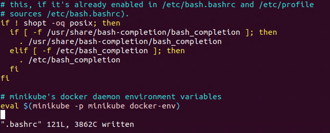
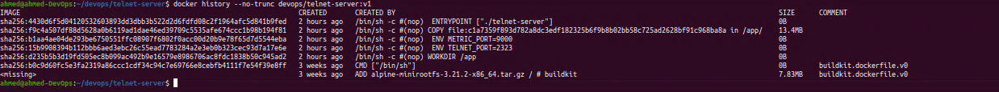
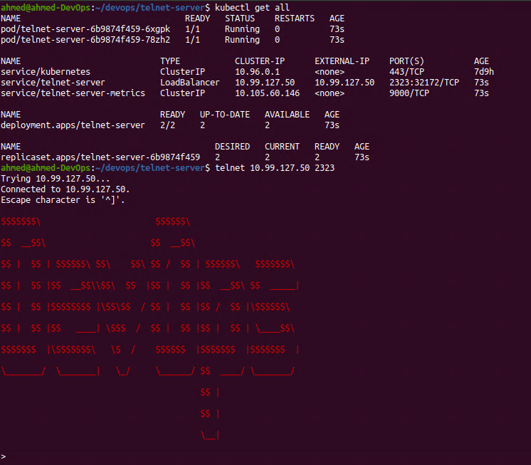
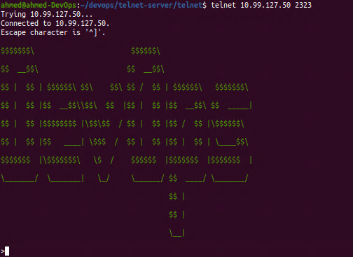

You can find the other parts by navigating my blog through the **Projects** tab or by following the links below:

- Part 1: https://ahmouden.com/projects/devops-homelab-part-1
- Part 2: You are here now.
- Part 3: https://ahmouden.com/projects/devops-homelab-part-3

Part 2 will cover the following:
- Containerizing an application with docker
- Orchestrating with kubernetes
- Deploying code


# 6 - Containerizing an Application with Docker

In this chapter we'll learn:
- install the Docker engine
- install the `docker` client CLI tool
- learn about Dockerfiles, container images, and containers
- how to containerize a sample application called `telent-server`

## Getting Started with Docker

The Docker framework performs **OS-level virtualization**, which means you can run multiple isolated applications as containers on a single OS kernel. Docker is great because it allows for efficient usage of the host resources unlike hardware virtualization that has a bigger overhead because each application needs its own VM but also slower than containers.

Docker containers are instances of Docker images which are described in Dockerfiles. So to create a container, you need first to write a **Dockerfile**, to then build a Docker image, to then finally create a container(s) from the image.

Containers images can be saved and served from a **registry**, like DockerHub.

### Dockerfile Instructions

> Dockerfile reference
>
> https://docs.docker.com/reference/dockerfile/

- `FROM` Specifies the parent or base image from which to build the new image (must be the first command in the file)
- `COPY` Adds files from your current directory (where the Dockerfile resides) to a destination in the image filesystem
- `RUN` Executes a command inside the image 
- `ADD` Copies new files or directories from either a source or a URL to a destination in the image filesystem
- `ENTRYPOINT` Makes your container run like an executable (which you can think of as any Linux command line application that takes arguments on your host)
- `CMD` Provides a default command or default parameters for the container (can be used in conjunction with ENTRYPOINT)

### Container Images and Layers

Images are made of layers. The layers houses the application, the dependencies, and enough filesystem for the application to run. Each instruction on the Dockerfile when executed creates a layer and stacks it on top of the previous layer. Each layer has its own unique hash. 

Layers can be shared across images, this way space and time isn't wasted on building or downloading layers that you already have on your machine.

Docker uses the **Union Filesystem (UFS)**, which allows multiple filesystems to come together and form what looks like a single filesystem. The layer at the very top of the layers stack is called the **container layer**, which is added when you create a container from an image. It is the only layer that you can write to. All other layers are Read-Only.

### Namespaces and Cgroups

What makes running containers on Linux in the first place is thanks to `namespaces` and `cgroups`. 

**Namespaces** limit what containers can see on the host machine, because they can isolate PIDs, network interfaces, User and Group IDs, etc. Namespaces for example make sure that a container can not see other running processes in other containers or in the host machine.

**Cgroups** limit what containers can use on the host machine by setting usage limits on the CPU, memory, disk I/O, and network.

Let's see how to install Docker and how to use it.

## Installing and Testing Docker

We'll install `minikube` because it contains the Docker Engine and Kubernetes (since we'll need it in the next chapters).

```sh
ahmed@ahmed-DevOps:~/devops$ curl -LO https://github.com/kubernetes/minikube/releases/latest/download/minikube-linux-amd64
  % Total    % Received % Xferd  Average Speed   Time    Time     Time  Current
                                 Dload  Upload   Total   Spent    Left  Speed
  0     0    0     0    0     0      0      0 --:--:-- --:--:-- --:--:--     0
  0     0    0     0    0     0      0      0 --:--:-- --:--:-- --:--:--     0
100  119M  100  119M    0     0  4238k      0  0:00:28  0:00:28 --:--:-- 4050k
ahmed@ahmed-DevOps:~/devops$ sudo install minikube-linux-amd64 /usr/local/bin/minikube && rm minikube-linux-amd64
[sudo] password for ahmed: 
ahmed@ahmed-DevOps:~/devops$ minikube version
minikube version: v1.35.0
commit: dd5d320e41b5451cdf3c01891bc4e13d189586ed-dirty
```

Like a said before, `minikube` install the Docker Engine and Kubernetes. It does this by launching a VM that contains both, the Docker Engine and Kubernetes. This means we need to tell `minikube` what provider to use (VirtualBox for our case), and we can modify the VM resources, the defaults are:
- CPUs=2
- Memory=2200MB
- Disk=20000MB

```sh
ahmed@ahmed-DevOps:~$ minikube start --driver=virtualbox
  minikube v1.35.0 on Ubuntu 20.04
✨  Using the virtualbox driver based on user configuration
  Downloading VM boot image ...
    > minikube-v1.35.0-amd64.iso....:  65 B / 65 B [---------] 100.00% ? p/s 0s
    > minikube-v1.35.0-amd64.iso:  345.38 MiB / 345.38 MiB  100.00% 4.64 MiB p/
  Starting "minikube" primary control-plane node in "minikube" cluster
  Downloading Kubernetes v1.32.0 preload ...
    > preloaded-images-k8s-v18-v1...:  333.57 MiB / 333.57 MiB  100.00% 4.93 Mi
  Creating virtualbox VM (CPUs=2, Memory=2200MB, Disk=20000MB) ...
  Preparing Kubernetes v1.32.0 on Docker 27.4.0 ...
    ▪ Generating certificates and keys ...
    ▪ Booting up control plane ...
    ▪ Configuring RBAC rules ...
  Configuring bridge CNI (Container Networking Interface) ...
  Verifying Kubernetes components...
    ▪ Using image gcr.io/k8s-minikube/storage-provisioner:v5
  Enabled addons: default-storageclass, storage-provisioner
  kubectl not found. If you need it, try: 'minikube kubectl -- get pods -A'
  Done! kubectl is now configured to use "minikube" cluster and "default" namespace by default
ahmed@ahmed-DevOps:~$ 
```

## Installing the Docker Client and Setting Up Docker Environment Variables

> Docs
>
> https://docs.docker.com/engine/install/binaries/#install-static-binaries


```sh
ahmed@ahmed-DevOps:~/Downloads$ wget https://download.docker.com/linux/static/stable/x86_64/docker-27.5.1.tgz
--2025-02-04 18:57:55--  https://download.docker.com/linux/static/stable/x86_64/docker-27.5.1.tgz
Resolving download.docker.com (download.docker.com)... 3.160.231.103, 3.160.231.8, 3.160.231.57, ...
Connecting to download.docker.com (download.docker.com)|3.160.231.103|:443... connected.
HTTP request sent, awaiting response... 200 OK
Length: 76186310 (73M) [application/x-tar]
Saving to: ‘docker-27.5.1.tgz’

docker-27.5.1.tgz                     100%[======================================================================>]  72,66M  3,64MB/s    in 22s     

2025-02-04 18:58:18 (3,25 MB/s) - ‘docker-27.5.1.tgz’ saved [76186310/76186310]

ahmed@ahmed-DevOps:~/Downloads$ ll
total 74412
drwxr-xr-x  2 ahmed ahmed     4096 févr.  4 18:57 ./
drwxr-xr-x 26 ahmed ahmed     4096 févr.  4 18:57 ../
-rw-rw-r--  1 ahmed ahmed 76186310 janv. 22 17:58 docker-27.5.1.tgz
ahmed@ahmed-DevOps:~/Downloads$ tar xzvf docker-27.5.1.tgz 
docker/
docker/runc
docker/containerd
docker/docker-init
docker/dockerd
docker/containerd-shim-runc-v2
docker/docker-proxy
docker/docker
docker/ctr
ahmed@ahmed-DevOps:~/Downloads$ sudo cp docker/* /usr/bin
[sudo] password for ahmed: 
ahmed@ahmed-DevOps:~/Downloads$
```

I downloaded the docker static binaries and put them in a file path `/usr/bin`. What we need is the docker client. Docker uses a client/server architecture. Next step is to tell the docker client the IP of the server it will connect to through envornment variables. In this case the server is in the `minikube` VM. `minikube` has a command to print the docker daemon information as environment variables (`minikube docker-env`).

```sh
ahmed@ahmed-DevOps:~/Downloads$ minikube docker-env
export DOCKER_TLS_VERIFY="1"
export DOCKER_HOST="tcp://192.168.59.100:2376"
export DOCKER_CERT_PATH="/home/ahmed/.minikube/certs"
export MINIKUBE_ACTIVE_DOCKERD="minikube"

# To point your shell to minikube's docker-daemon, run:
# eval $(minikube -p minikube docker-env)
```

Here is an example before when the docker client doesn't have the necessary information to talk to the docker daemon (server), and after:

```sh
ahmed@ahmed-DevOps:~/Downloads$ docker version
Client:
 Version:           27.5.1
 API version:       1.47
 Go version:        go1.22.11
 Git commit:        9f9e405
 Built:             Wed Jan 22 13:40:02 2025
 OS/Arch:           linux/amd64
 Context:           default
permission denied while trying to connect to the Docker daemon socket at unix:///var/run/docker.sock: Get "http://%2Fvar%2Frun%2Fdocker.sock/v1.47/version": dial unix /var/run/docker.sock: connect: permission denied
ahmed@ahmed-DevOps:~/Downloads$ eval $(minikube docker-env)
ahmed@ahmed-DevOps:~/Downloads$ docker version
Client:
 Version:           27.5.1
 API version:       1.47
 Go version:        go1.22.11
 Git commit:        9f9e405
 Built:             Wed Jan 22 13:40:02 2025
 OS/Arch:           linux/amd64
 Context:           default

Server: Docker Engine - Community
 Engine:
  Version:          27.4.0
  API version:      1.47 (minimum version 1.24)
  Go version:       go1.22.10
  Git commit:       92a8393
  Built:            Sat Dec  7 10:39:05 2024
  OS/Arch:          linux/amd64
  Experimental:     false
 containerd:
  Version:          v1.7.23
  GitCommit:        57f17b0a6295a39009d861b89e3b3b87b005ca27
 runc:
  Version:          1.2.3
  GitCommit:        0d37cfd4b557771e555a184d5a78d0ed4bdb79a5
 docker-init:
  Version:          0.19.0
  GitCommit:        de40ad0
ahmed@ahmed-DevOps:~/Downloads$ 
```

One small little detail is the `eval $(minikube -p minikube docker-env)` command exports the docker server environment variables that the client needs into the terminal session, but once the session ends (you close the terminal for example), the environment variables are lost. 

This is why we need to add this command into the `~/.bashrc` or the `~/.zshrc` configuration files, so whenever a new session starts the command gets executed and the environment variables are exported to the session.

In my Ubuntu machine I'm using Bash, so I'll edit the `~/.bashrc` file:



And to test the Docker Client connectivity, use the `docker version` command to see the client and **server** information:

```sh
ahmed@ahmed-DevOps:~$ docker version
Client:
 Version:           27.5.1
 API version:       1.47
 Go version:        go1.22.11
 Git commit:        9f9e405
 Built:             Wed Jan 22 13:40:02 2025
 OS/Arch:           linux/amd64
 Context:           default

Server: Docker Engine - Community
 Engine:
  Version:          27.4.0
  API version:      1.47 (minimum version 1.24)
  Go version:       go1.22.10
  Git commit:       92a8393
  Built:            Sat Dec  7 10:39:05 2024
  OS/Arch:          linux/amd64
  Experimental:     false
 containerd:
  Version:          v1.7.23
  GitCommit:        57f17b0a6295a39009d861b89e3b3b87b005ca27
 runc:
  Version:          1.2.3
  GitCommit:        0d37cfd4b557771e555a184d5a78d0ed4bdb79a5
 docker-init:
  Version:          0.19.0
  GitCommit:        de40ad0
ahmed@ahmed-DevOps:~$ 
```

## Containerizing a Sample Application

The sample application we will be working with is called `telnet-server` and it is written in Go. 

To containerize an application, you'll need the source code or the binary of the app that we are going to run in the container plus the Dockerfile to build the container image.


The Dockerfile we'll be using for `telnet-server` will be a multi-stage builds Dockerfile for optimization purposes. We want the final image to be as small as possible.

With multi-stage builds, you use multiple `FROM` statements in your Dockerfile. Each `FROM` instruction can use a different base, and each of them begins a new stage of the build. You can selectively copy artifacts from one stage to another, leaving behind everything you don't want in the final image.

> Multi-stage builds Docs
>
> https://docs.docker.com/build/building/multi-stage/


Our Dockerfile will have two stages:
- *build* stage: will container the application source code, and will be based on an Alpine Linux container image that contains Go and all the needed dependencies.
- *final* stage: Based on a smaller and secure Linux image. We will copy the compiled binary from the *build* stage to this image. We don't need the other stuff like the source code or dependencies, we only need the binary to execute it to run the application.


Here is the multi-stage builds Dockerfile:

```Dockerfile
# Build stage
FROM golang:alpine AS build-env
ADD . /
RUN cd / && go build -o telnet-server

# final stage
FROM alpine:latest as final
WORKDIR /app
ENV TELNET_PORT 2323
ENV METRIC_PORT 9000
COPY --from=build-env /telnet-server /app/

ENTRYPOINT ["./telnet-server"]
```

Let's break it down:

- `FROM golang:alpine AS build-env`: The `FROM` instruction will pull in the `golang:alpine` Alpine Linux image from the Docker Hub registry that is prebuilt for developing in the Go language. This image stage will be called `build-env`. This name reference will be used in the final stage.
- `ADD . /`: The `ADD` instruction copies the contents of the current local directory `telnet-server` which contains the source code and configs of the app to the image's filesystem root directory.
- `RUN cd / && go build -o telnet-server`: The `RUN` instruction is used to execute commands. The command it will execute is to change the working directory to the root directory where we copied the app source code and then tell go to build the application into a binary called `telnet-server`.

Now the first stage is done, and to start the second stage we'll use the `FROM` instruction again.

- `FROM apline:latest as final`: The second stage will be using the `alpine:latest` Alpine Linux image. This image is optimal as the final image because it is very light and doesn't contain any dependencies.
- `WORKDIR /app`: The `WORKDIR` instruction sets the working directory for any `RUN`, `CMD`, `ENTRYPOINT`, `COPY` and `ADD` instructions that follow it in the Dockerfile. If the `WORKDIR` doesn't exist, it will be created even if it's not used in any subsequent Dockerfile instruction. Using `WORKDIR` is a best practice instead of using `cd` to move between directories.
- `ENV TELNET_PORT 2323`: The `ENV` instruction sets the environment variable `<key>` to the value `<value>`. This value will be in the environment for all subsequent instructions in the build stage and can be replaced inline in many as well. We are setting the environment variable `TELNET` to the value `2323`.
- `ENV METRIC_PORT 9000`: Sets the environment variable `METRIC_PORT` to the value `9000`.
- `COPY --from=build-env /telnet-server /app/`: The `COPY` instruction is used here to copy the binary `telnet-server` from the `build-env` stage to the `/app/` directory (which is also the working directory of the *final* image). The `ADD` instruction also copies files and directories but from remote locations and it doesn't support copying files from one stage to another in a multi-stage build.
- `ENTRYPOINT ["./telnet-server"]`: The `ENTRYPOINT` instruction is used to set the image's main command. Here we want the image to run the binary `telnet-server` to run the application.


### Building the Container Image

Great now that we have the Dockerfile ready, let's build the docker image.

The command to build the docker image will be of this syntax:

```sh
docker build -t <HOST>:<NAMESPACE>/<REPOSITORY>:<TAG> . 
```

- HOST: The optinal registry hostname where the image is located. default registry is `docker.io`.
- NAMESPACE: The user's or organization's name. Default is `library`.
- REPOSITORY: The images repository name, for example: `golang`, `redis`, etc
- TAG: A tag is a human readable **identifier** to identify different versions or variants of an image. Default is `latest`.
- The dot `.` is called the **build context**, which is the directory where the app files live.

Some examples of image names:
- `nginx`, equivalent to `docker.io/library/nginx:latest`: this pulls an image from the `docker.io` registry, the `library` namespace, the `nginx` image repository, and the `latest` tag.

- `docker/welcome-to-docker`, equivalent to `docker.io/docker/welcome-to-docker:latest`: this pulls an image from the `docker.io` registry, the `docker` namespace, the `welcome-to-docker` image repository, and the `latest` tag


I'll be naming the image: `devops/telnet-server:v1`. And for the registry, the image will be stored in `minikube`'s registry.

```sh
ahmed@ahmed-DevOps:~/devops/telnet-server$ docker build -t devops/telnet-server:v1 .
DEPRECATED: The legacy builder is deprecated and will be removed in a future release.
            Install the buildx component to build images with BuildKit:
            https://docs.docker.com/go/buildx/

Sending build context to Docker daemon  32.26kB
Step 1/9 : FROM golang:alpine AS build-env
 ---> 038b36ac86e1
Step 2/9 : ADD . /
 ---> Using cache
 ---> 6028999c8e98
Step 3/9 : RUN cd / && go build -o telnet-server
 ---> Running in 3435b01fe12d
go: downloading github.com/prometheus/client_golang v1.6.0
go: downloading github.com/beorn7/perks v1.0.1
go: downloading github.com/cespare/xxhash/v2 v2.1.1
go: downloading github.com/golang/protobuf v1.4.0
go: downloading github.com/prometheus/client_model v0.2.0
go: downloading github.com/prometheus/common v0.9.1
go: downloading github.com/prometheus/procfs v0.0.11
go: downloading google.golang.org/protobuf v1.21.0
go: downloading github.com/matttproud/golang_protobuf_extensions v1.0.1
go: downloading golang.org/x/sys v0.0.0-20200420163511-1957bb5e6d1f
 ---> Removed intermediate container 3435b01fe12d
 ---> 2c1471ff205f
Step 4/9 : FROM alpine:latest as final
latest: Pulling from library/alpine
1f3e46996e29: Already exists 
Digest: sha256:56fa17d2a7e7f168a043a2712e63aed1f8543aeafdcee47c58dcffe38ed51099
Status: Downloaded newer image for alpine:latest
 ---> b0c9d60fc5e3
Step 5/9 : WORKDIR /app
 ---> Running in 5cfcf640e1c1
 ---> Removed intermediate container 5cfcf640e1c1
 ---> d235b5b3d19f
Step 6/9 : ENV TELNET_PORT 2323
 ---> Running in 54760b52844a
 ---> Removed intermediate container 54760b52844a
 ---> 15b9908394b1
Step 7/9 : ENV METRIC_PORT 9000
 ---> Running in 7255504b6445
 ---> Removed intermediate container 7255504b6445
 ---> b1aa4ae04de2
Step 8/9 : COPY --from=build-env /telnet-server /app/
 ---> f9c4a507df88
Step 9/9 : ENTRYPOINT ["./telnet-server"]
 ---> Running in c5673866d0e8
 ---> Removed intermediate container c5673866d0e8
 ---> 4430d6f5d041
Successfully built 4430d6f5d041
Successfully tagged devops/telnet-server:v1
ahmed@ahmed-DevOps:~/devops/telnet-server$
```

### Verifiying the Docker Image

Let's verify the registry inside `minikube` is storing the `telnet-server` image.

```sh
ahmed@ahmed-DevOps:~/devops/telnet-server$ docker image ls devops/telnet-server
REPOSITORY             TAG       IMAGE ID       CREATED          SIZE
devops/telnet-server   v1        4430d6f5d041   14 minutes ago   21.2MB
ahmed@ahmed-DevOps:~/devops/telnet-server$ 
```

And about the images size, check out the size of the parent image of the build stage that contains go and the dependencies, the size of the parent image `alpine` that we used in the final stage, and the size of the final image that contains the binary:

```sh
ahmed@ahmed-DevOps:~/devops/telnet-server$ docker image ls
REPOSITORY                                TAG        IMAGE ID       CREATED          SIZE
devops/telnet-server                      v1         4430d6f5d041   14 minutes ago   21.2MB
golang                                    alpine     038b36ac86e1   5 hours ago      246MB
alpine                                    latest     b0c9d60fc5e3   3 weeks ago      7.83MB
```

The final base image was ~ 8MBs, and the final image is 21.2MBs.

### Running the Container

Now that we have the image, let's create a container from it and run the telnet server.

```sh
ahmed@ahmed-DevOps:~/devops/telnet-server$ docker run -p 2323:2323 -d --name telnet-server devops/telnet-server:v1
fa415dea6dbefe8f6b3551150260cf37a18e23e006846a9ec62b0060b0b6d4f7
ahmed@ahmed-DevOps:~/devops/telnet-server$ 
```

- `-p 2323:2323`: This binds the right TCP port `2323` of the container to the left TCP port `2323` of the host. We need to do this because the server runs at port `2323`, and we want to be able to access it from our host in the same port.
- `-d`: or `--detach` flag to start a container in **Detached mode** or as a background process that doesn't occupy your terminal window.
- `--name`: This flag lets you specify an identifier or name to the container.

The `run` command is successful because it returned the container ID.

Let's verify the container is actually running:

```sh
ahmed@ahmed-DevOps:~/devops/telnet-server$ docker container ls -f name=telnet-server
CONTAINER ID   IMAGE                     COMMAND             CREATED         STATUS         PORTS                    NAMES
fa415dea6dbe   devops/telnet-server:v1   "./telnet-server"   8 minutes ago   Up 8 minutes   0.0.0.0:2323->2323/tcp   telnet-server
ahmed@ahmed-DevOps:~/devops/telnet-server$ 
```

- `f`: The filter flag.

We can stop and start a container using the `start` and `stop` commands. If they are successful, Docker returns the name of the container.

```sh
ahmed@ahmed-DevOps:~/devops/telnet-server$ docker container stop telnet-server
telnet-server
ahmed@ahmed-DevOps:~/devops/telnet-server$ docker container start telnet-server
telnet-server
```
We can run commands inside the container using the `exec` command. For example we can check if the environment variables we set in the Dockerfile are actually set in the container:

```sh
ahmed@ahmed-DevOps:~/devops/telnet-server$ docker exec telnet-server env
PATH=/usr/local/sbin:/usr/local/bin:/usr/sbin:/usr/bin:/sbin:/bin
HOSTNAME=fa415dea6dbe
TELNET_PORT=2323
METRIC_PORT=9000
HOME=/root
ahmed@ahmed-DevOps:~/devops/telnet-server$
```

We can also get a shell and interact with the container using the `exec` command and a few special flags:

```sh
ahmed@ahmed-DevOps:~/devops/telnet-server$ docker exec -it telnet-server /bin/sh
/app # whoami
root
/app # ls
telnet-server
/app # ls -al
total 13060
drwxr-xr-x    1 root     root          4096 Feb  4 23:34 .
drwxr-xr-x    1 root     root          4096 Feb  4 23:54 ..
-rwxr-xr-x    1 root     root      13362062 Feb  4 23:33 telnet-server
/app # 
```

- `-i`: The interactive flag. It keeps STDIN open so you can type commands inside the container.
- `-t`: The pseudo-TTY  flag. It tells the container that the input will be coming from a terminal (the terminal we are currently using). When combined with the `-i` flag, the actual input of the terminal gets sent as STDIN to the container, so basically it's a terminal.
- `/bin/sh`: The Alpine default shell.

You can remove a **stopped** container using the `rm` command:

```sh
ahmed@ahmed-DevOps:~/devops/telnet-server$ docker container ls | grep telnet-server
fa415dea6dbe   devops/telnet-server:v1      "./telnet-server"        41 minutes ago   Up 30 minutes   0.0.0.0:2323->2323/tcp   telnet-server
ahmed@ahmed-DevOps:~/devops/telnet-server$ docker container stop telnet-server
telnet-server
ahmed@ahmed-DevOps:~/devops/telnet-server$ docker container rm telnet-server
telnet-server
ahmed@ahmed-DevOps:~/devops/telnet-server$ docker container ls | grep telnet-server
ahmed@ahmed-DevOps:~/devops/telnet-server$ docker run -p 2323:2323 -d --name telnet-server devops/telnet-server:v1
c9ac72506ce4218061705c7b3873490a8f2396e63705bdd8c9c041c481507545
ahmed@ahmed-DevOps:~/devops/telnet-server$ 
```

### Inpecting Docker Objects

The `inspect` command returns detailed information on Docker Objects. What is a Docker Object? Here they are: `container|image|node|network|secret|service|volume|task|plugin`.

Let's inspect the `telnet-server` container. The output is very verbose, so I'll just show the `State` and `NetworkSettings` parts with the help of `jq`:

```json
ahmed@ahmed-DevOps:~/devops/telnet-server$ docker inspect telnet-server | jq '.[].State'
{
  "Status": "running",
  "Running": true,
  "Paused": false,
  "Restarting": false,
  "OOMKilled": false,
  "Dead": false,
  "Pid": 95818,
  "ExitCode": 0,
  "Error": "",
  "StartedAt": "2025-02-05T00:36:59.682751415Z",
  "FinishedAt": "0001-01-01T00:00:00Z"
}
```

The `Status` and `StartedAt` keys can be very helpful in debugging tricky bugs.

```json
ahmed@ahmed-DevOps:~/devops/telnet-server$ docker inspect telnet-server | jq '.[].NetworkSettings'
{
  "Bridge": "",
  "SandboxID": "1d145780aa32d4c811a955d579f94b04c770f63f65ef01ab9b258849670e4185",
  "SandboxKey": "/var/run/docker/netns/1d145780aa32",
  "Ports": {
    "2323/tcp": [
      {
        "HostIp": "0.0.0.0",
        "HostPort": "2323"
      }
    ]
  },
  "HairpinMode": false,
  "LinkLocalIPv6Address": "",
  "LinkLocalIPv6PrefixLen": 0,
  "SecondaryIPAddresses": null,
  "SecondaryIPv6Addresses": null,
  "EndpointID": "623117175a95d6c525273f3bb5e4e9eb16bc3f3a12cd5adbf4bf3b560c9db819",
  "Gateway": "172.17.0.1",
  "GlobalIPv6Address": "",
  "GlobalIPv6PrefixLen": 0,
  "IPAddress": "172.17.0.2",
  "IPPrefixLen": 16,
  "IPv6Gateway": "",
  "MacAddress": "02:42:ac:11:00:02",
  "Networks": {
    "bridge": {
      "IPAMConfig": null,
      "Links": null,
      "Aliases": null,
      "MacAddress": "02:42:ac:11:00:02",
      "DriverOpts": null,
      "NetworkID": "07da27a3c6afa1faec4c180598585d2f6f5514e35d9f4e6b8f14c64bb437270f",
      "EndpointID": "623117175a95d6c525273f3bb5e4e9eb16bc3f3a12cd5adbf4bf3b560c9db819",
      "Gateway": "172.17.0.1",
      "IPAddress": "172.17.0.2",
      "IPPrefixLen": 16,
      "IPv6Gateway": "",
      "GlobalIPv6Address": "",
      "GlobalIPv6PrefixLen": 0,
      "DNSNames": null
    }
  }
}
```

The `Ports` and `IPAddress` can also be very helpful in debugging networking problems.

### History of an Image

The `history` command is used to show the history of an image. 

```sh
ahmed@ahmed-DevOps:~/devops/telnet-server$ docker history --no-trunc devops/telnet-server:v1
IMAGE                                                                     CREATED       CREATED BY                                                                                               SIZE      COMMENT
sha256:4430d6f5d04120532603893dd3dbb3b522d2d6fdfd08c2f1964afc5d841b9fed   2 hours ago   /bin/sh -c #(nop)  ENTRYPOINT ["./telnet-server"]                                                        0B        
sha256:f9c4a507df88d5628a0b6119ad1dae46ed39709c5535afe674ccc1b98b194f81   2 hours ago   /bin/sh -c #(nop) COPY file:c1a7359f893d782a8dc3edf182325b6f9b8b02bb58c725ad2628bf91c968ba8a in /app/    13.4MB    
sha256:b1aa4ae04de293be6750551ffc08907f6802f0acc00d20b9e78f65d7d5544eba   2 hours ago   /bin/sh -c #(nop)  ENV METRIC_PORT=9000                                                                  0B        
sha256:15b9908394b112bbb6aed3ebc26c55ead7783284a2e3eb0b323cec93d7a17e6e   2 hours ago   /bin/sh -c #(nop)  ENV TELNET_PORT=2323                                                                  0B        
sha256:d235b5b3d19fd505ec8b099ac492b9e16579e8986706ac8fdc1838b50c945ad2   2 hours ago   /bin/sh -c #(nop) WORKDIR /app                                                                           0B        
sha256:b0c9d60fc5e3fa2319a86ccc1cdf34c94c7e69766e8cebfb4111f7e54f39e8ff   3 weeks ago   CMD ["/bin/sh"]                                                                                          0B        buildkit.dockerfile.v0
<missing>                                                                 3 weeks ago   ADD alpine-minirootfs-3.21.2-x86_64.tar.gz / # buildkit                                                  7.83MB    buildkit.dockerfile.v0
ahmed@ahmed-DevOps:~/devops/telnet-server$ 
```



It tells us the layers of the image like the base image, and the commands of each layer plus the size of each layer.

### Container Statistics

The `stats` command displays a live stream of container(s) resource usage statistics. It shows us how much resources (CPU, RAM, disk I/O, Net I/O) the container is using.

```sh
ahmed@ahmed-DevOps:~/devops/telnet-server$ docker container stats --no-stream telnet-server
CONTAINER ID   NAME            CPU %     MEM USAGE / LIMIT     MEM %     NET I/O     BLOCK I/O   PIDS
c9ac72506ce4   telnet-server   0.00%     1.492MiB / 2.064GiB   0.07%     312B / 0B   0B / 0B     5
ahmed@ahmed-DevOps:~/devops/telnet-server$ 
```

The `telnet-server` is using no CPU, 1.5 MBs of RAM (0.07%) of the 2 GBs allocated to the container, and almost nothing of network bandwidth. This shows how much containers are really lightweight and efficient.

## Testing the Container

Time to test the application. We gonna connect to the application server inside the container. We need to install first `telnet` the client to talk to the server.

The `telnet-server` is listening on the port `2323` inside a container inside a VirtualBox VM inside the Ubuntu host machine. The client is in the Ubuntu host machine. The container port `2323` is bound to the VM port `2323`. The Ubuntu host machine can access all the VMs ports. We just need the IP address of the `minikube` VirutalBox VM, so we can access the `telnet-server` through it.

```sh
ahmed@ahmed-DevOps:~/devops/telnet-server$ minikube ip
192.168.59.100
```

And let's connect to the `telnet-server`:

```sh
ahmed@ahmed-DevOps:~/devops/telnet-server$ telnet 192.168.59.100 2323
Trying 192.168.59.100...
Connected to 192.168.59.100.
Escape character is '^]'.

____________ ___________
|  _  \  ___|_   _|  _  \
| | | | |_    | | | | | |
| | | |  _|   | | | | | |
| |/ /| |     | | | |/ /
|___/ \_|     \_/ |___/

>h 
unknown command: h
>help
Command Help:
1) (q)uit -- quits
2) (d)ate -- prints the current datetime
3) (y)ell for sysop -- gets the sysop
4) (?) help -- prints this message
>d
Wed Feb 5 02:26:11 +0000 UTC 2025
>y
SysOp will be with you shortly
>q
Good Bye!
Connection closed by foreign host.
ahmed@ahmed-DevOps:~/devops/telnet-server$ 
```

The application and container works!

If we ever make a change to the application source code, we need to build the image again, push it into the registry, stop the current container, and replace the current image with the new one and create a new container from the new image.

In matter of fact let's do it now!

I'll be changing the ASCII art the server returns when we connect with it.

After i changed the source code, and building a new image with the same image name, i removed the container, and created a new a container from it:

```sh
ahmed@ahmed-DevOps:~/devops/telnet-server$ docker container rm telnet-server
telnet-server
ahmed@ahmed-DevOps:~/devops/telnet-server$ docker run -p 2323:2323 -d --name telnet-server devops/telnet-server:v1
418edbd0b0d7d7c73ab63fe1c57aeadbd05288a82783eccdd0c12ad508789f2b
ahmed@ahmed-DevOps:~/devops/telnet-server$ minikube ip
192.168.59.100
ahmed@ahmed-DevOps:~/devops/telnet-server$ telnet 192.168.59.100 2323
Trying 192.168.59.100...
Connected to 192.168.59.100.
Escape character is '^]'.

$$$$$$$\                       $$$$$$\                      

$$  __$$\                     $$  __$$\                     

$$ |  $$ | $$$$$$\ $$\    $$\ $$ /  $$ | $$$$$$\   $$$$$$$\ 

$$ |  $$ |$$  __$$\\$$\  $$  |$$ |  $$ |$$  __$$\ $$  _____|

$$ |  $$ |$$$$$$$$ |\$$\$$  / $$ |  $$ |$$ /  $$ |\$$$$$$\  

$$ |  $$ |$$   ____| \$$$  /  $$ |  $$ |$$ |  $$ | \____$$\ 

$$$$$$$  |\$$$$$$$\   \$  /    $$$$$$  |$$$$$$$  |$$$$$$$  |

\_______/  \_______|   \_/     \______/ $$  ____/ \_______/ 

                                        $$ |                

                                        $$ |                

                                        \__| 

>help
Command Help:
1) (q)uit -- quits
2) (d)ate -- prints the current datetime
3) (y)ell for sysop -- gets the sysop
4) (?) help -- prints this message
>d
```

## Getting Logs from the Container

We can get the logs inside the container for debugging and forensics purposes.

`docker logs <container>` retrieves logs from the container's `STDOUT` and `STDERR`, meaning whenever the container process prints something to STDOUT or STDERR, it will get retrieved by the `logs` command.

```sh
ahmed@ahmed-DevOps:~/devops/telnet-server$ docker logs telnet-server
telnet-server: 2025/02/05 02:45:20 Metrics endpoint listening on :9000
telnet-server: 2025/02/05 02:45:20 telnet-server listening on [::]:2323
telnet-server: 2025/02/05 02:45:37 [IP=192.168.59.1] New session
telnet-server: 2025/02/05 02:45:41 [IP=192.168.59.1] Requested command: help
telnet-server: 2025/02/05 02:45:44 [IP=192.168.59.1] Requested command: d
telnet-server: 2025/02/05 02:45:45 [IP=192.168.59.1] Requested command: y
telnet-server: 2025/02/05 02:45:46 [IP=192.168.59.1] Requested command: a
telnet-server: 2025/02/05 02:45:47 [IP=192.168.59.1] User quit session
ahmed@ahmed-DevOps:~/devops/telnet-server$ 
```

The two first log entries are startup messages showing that the server is running and a metrics log entry. The rest of the logs are from the `telnet-server` logging the client session.

# 7 - Orchestrating With Kubernetes

***Orchestration*** solves:
- managing thousands of containers
- load balancing
- availability


## Deploying the Sample telnet-server Application

For our Kubernetes cluster, we will do the following:
- create a Deployment
- create two services for the telnet-server application to expose two ports: the server application port and the application metrics port.

By the end we'll have a Deployment with two Pods (replicas) running the telnet-server application.

### Interacting with Kubernetes

Before we do anything, we need to make sure we have `kubectl`. Either we download the standalone binary or leverage `minikube`'s command `minikube kubectl` command so it can get it for us. I'll go with the latter.

```sh
ahmed@ahmed-DevOps:~$ minikube kubectl
    > kubectl.sha256:  64 B / 64 B [-------------------------] 100.00% ? p/s 0s
    > kubectl:  54.67 MiB / 54.67 MiB [--------------] 100.00% 4.32 MiB p/s 13s
kubectl controls the Kubernetes cluster manager.

 Find more information at: https://kubernetes.io/docs/reference/kubectl/

Basic Commands (Beginner):
  create          Create a resource from a file or from stdin
  expose          Take a replication controller, se
--SNIP--
```

A good test is to ask for the cluster information to test the connection between `kubectl` and the `minikube` cluster.

```sh
ahmed@ahmed-DevOps:~$ minikube kubectl cluster-info
error: cluster "minikube" does not exist
```

The reason of the error is I stopped the cluster, so I need to start it up back again

```sh
ahmed@ahmed-DevOps:~$ minikube start
  minikube v1.35.0 on Ubuntu 20.04
✨  Using the virtualbox driver based on existing profile
  Starting "minikube" primary control-plane node in "minikube" cluster
  Restarting existing virtualbox VM for "minikube" ...
  Preparing Kubernetes v1.32.0 on Docker 27.4.0 ...
  Configuring bridge CNI (Container Networking Interface) ...
  Verifying Kubernetes components...
    ▪ Using image gcr.io/k8s-minikube/storage-provisioner:v5
  Enabled addons: storage-provisioner, default-storageclass
  kubectl not found. If you need it, try: 'minikube kubectl -- get pods -A'
  Done! kubectl is now configured to use "minikube" cluster and "default" namespace by default
```

Now It works

```sh
ahmed@ahmed-DevOps:~$ minikube kubectl cluster-info
Kubernetes control plane is running at https://192.168.59.100:8443
CoreDNS is running at https://192.168.59.100:8443/api/v1/namespaces/kube-system/services/kube-dns:dns/proxy

To further debug and diagnose cluster problems, use 'kubectl cluster-info dump'.
ahmed@ahmed-DevOps:~$ 
```

### Reviewing the Manifests

We'll be using two manifests, one for the deployment and one for the two services.

The Deployment manifest will be called `telnet-server`, will create 2 replicas, will use a Rolling deployment strategy, will be based on the container image we created previously `devops/telnet-server:v1`, and each container will expose two ports `2323` and `9000`.

Here is the `deployment.yaml` manifest:

```yaml
apiVersion: apps/v1
kind: Deployment
metadata:
  name: telnet-server
  labels:
    app: telnet-server
spec:
  replicas: 2
  selector:
    matchLabels:
      app: telnet-server
  strategy:
    type: RollingUpdate
    rollingUpdate:
      maxSurge: 1        # how many pods we can add at a time
      maxUnavailable: 0  # maxUnavailable define how many pods can be unavailable
  template:
    metadata:
      labels:
        app: telnet-server
      annotations:
        prometheus.io/scrape: 'true'
        prometheus.io/port:   '9000'
    spec:
      containers:
      - image: devops/telnet-server:v1
        imagePullPolicy: IfNotPresent
        name: telnet-server
        resources:
          requests:
            cpu: 0.1
            memory: 1M
          limits:
            cpu: 0.5
            memory: 100M
        ports:
        - containerPort: 2323
          name: telnet
        - containerPort: 9000
          name: metrics
```


Let's explain somethings in this manifest. Let's start with the `template` block:

```yml
 template:
    metadata:
      labels:
        app: telnet-server
      annotations:
        prometheus.io/scrape: 'true'
        prometheus.io/port:   '9000'
```

- `.metadata.labels`: This fields gives the Pods labels. In our case it gives the Pods the `app: telnet-server` label (notice how this labels is used above in the `selector.matchLabels.app` field to select the pods).
- `annotations`: Annotations are non-identifying metadata to attach to objects that can be used by third-party tools. In our case, Prometheus in order to scrape the nodes successfully for metrics data, it needs explicit permission to do so `prometheus.io/scrape: 'true'` and it needs to know which port to scrape the metrics from `prometheus.io/port:   '9000'`.


Next manifest is the `service.yaml` for the two services:

```yml
---
apiVersion: v1
kind: Service
metadata:
  name: telnet-server
  labels:
    app: telnet-server
spec:
  ports:
  - port: 2323
    name: telnet
    protocol: TCP
    targetPort: 2323
  selector:
    app: telnet-server
  type: LoadBalancer
---
apiVersion: v1
kind: Service
metadata:
  name: telnet-server-metrics
  labels:
    app: telnet-server
  annotations:
      prometheus.io/scrape: 'true'
      prometheus.io/port:   '9000'
spec:
  ports:
  - name: metrics
    port: 9000
    protocol: TCP
    targetPort: 9000
  selector:
    app: telnet-server
  type: ClusterIP
```

The first service is of type `LoadBalancer`. It will expose the application to requests outside the cluster. The second service is of type `ClusterIP`, it will expose the metrics port `9000` to resources inside the cluster only.


Let's create the Deployment and services in the cluster now:

```sh
ahmed@ahmed-DevOps:~$ minikube kubectl -- apply -f devops/telnet-server/kubernetes/
deployment.apps/telnet-server created
service/telnet-server created
service/telnet-server-metrics created
ahmed@ahmed-DevOps:~$
```

### Viewing the Deployment and Services

Let's check the status of the objects we just created. We can do that using the `get <resource> <name>` `kubectl`'s command.

```sh
ahmed@ahmed-DevOps:~$ minikube kubectl -- get deployments.apps telnet-server
NAME            READY   UP-TO-DATE   AVAILABLE   AGE
telnet-server   2/2     2            2           4m1s
ahmed@ahmed-DevOps:~$ 
```

`deployments.apps` is two parts:
- `deployments` which is the resource name
- `apps` the API group name

We have `2` replicas up and running, at least that is what kubernetes believes.

We can list the Pods using the `get pods` command. But in a production environment it is not unusual to have hundreds (if not thousands) of pods running. In this case we can use the labels to filter the pods. We can filter by labels using the `-l` switch:

```sh
ahmed@ahmed-DevOps:~$ minikube kubectl -- get pods
NAME                            READY   STATUS    RESTARTS   AGE
telnet-server-c9df4565d-ld8gs   1/1     Running   0          6m35s
telnet-server-c9df4565d-wd8g5   1/1     Running   0          6m35s
ahmed@ahmed-DevOps:~$ minikube kubectl -- get pods -l app=telnet-server
NAME                            READY   STATUS    RESTARTS   AGE
telnet-server-c9df4565d-ld8gs   1/1     Running   0          6m49s
telnet-server-c9df4565d-wd8g5   1/1     Running   0          6m49s
ahmed@ahmed-DevOps:~$ 
```

There we have the `2` Pods running.

Now let's list the services using the label

```sh
ahmed@ahmed-DevOps:~$ minikube kubectl -- get services -l app=telnet-server
NAME                    TYPE           CLUSTER-IP       EXTERNAL-IP   PORT(S)          AGE
telnet-server           LoadBalancer   10.106.48.173    <pending>     2323:30311/TCP   10m
telnet-server-metrics   ClusterIP      10.106.142.217   <none>        9000/TCP         10m
ahmed@ahmed-DevOps:~$ 
```

The `LoadBalancer` service is `<pending>` because `minikube` doesn't come with a LoadBalancer the service can use.

For the `ClusterIP` service, it can be reached from inside the cluster using either the IP `10.106.142.217` or the **Canonical Name** `telnet-server-metrics`. Using the canonical name is recommended over the IP.

## Testing the Deployment and Services

Here is what we are testing:

- the telnet server is accessible using a telnet client
- the Deployment's resiliency by killing a telnet-server Pod and watching it recover
- scaling up and down our Deployment replicas

### Accessing the Telnet Server

We are using a `LoadBalancer` service to expose the telnet server to the internet by giving it its own IP and canonical name and port. The thing is, `minikube` doesn't come with a Load Balancer that it can use. That is why `minikube` has the command `tunnel` that mimicks a load balancer which allows a service to be accessible outside the `minikube` cluster.

Also we need to let the process keep running for the tunnel (and Load Balancer) to also keep running. 

```sh
ahmed@ahmed-DevOps:~$ minikube tunnel
[sudo] password for ahmed: 
Status:	
	machine: minikube
	pid: 5370
	route: 10.96.0.0/12 -> 192.168.59.100
	minikube: Running
	services: [telnet-server]
    errors: 
		minikube: no errors
		router: no errors
		loadbalancer emulator: no errors

```

Now that the `telnet-server` `LoadBalancer` service has an emulated Load Balancer (by the `tunnel` command), it should now have an `EXTERNAL_IP`, let's check:

```sh
ahmed@ahmed-DevOps:~$ minikube kubectl -- get svc -l app=telnet-server
NAME                    TYPE           CLUSTER-IP       EXTERNAL-IP     PORT(S)          AGE
telnet-server           LoadBalancer   10.106.48.173    10.106.48.173   2323:30311/TCP   98m
telnet-server-metrics   ClusterIP      10.106.142.217   <none>          9000/TCP         98m
ahmed@ahmed-DevOps:~$ 
```

Great! The `telnet-server` is now exposed through the `10.106.48.173` IP and the `2323` port. And now to test the server connectivity:

```sh
ahmed@ahmed-DevOps:~$ telnet 10.106.48.173 2323
Trying 10.106.48.173...
Connected to 10.106.48.173.
Escape character is '^]'.

$$$$$$$\                       $$$$$$\                      

$$  __$$\                     $$  __$$\                     

$$ |  $$ | $$$$$$\ $$\    $$\ $$ /  $$ | $$$$$$\   $$$$$$$\ 

$$ |  $$ |$$  __$$\\$$\  $$  |$$ |  $$ |$$  __$$\ $$  _____|

$$ |  $$ |$$$$$$$$ |\$$\$$  / $$ |  $$ |$$ /  $$ |\$$$$$$\  

$$ |  $$ |$$   ____| \$$$  /  $$ |  $$ |$$ |  $$ | \____$$\ 

$$$$$$$  |\$$$$$$$\   \$  /    $$$$$$  |$$$$$$$  |$$$$$$$  |

\_______/  \_______|   \_/     \______/ $$  ____/ \_______/ 

                                        $$ |                

                                        $$ |                

                                        \__| 

>
```

And it works!

### Troubleshooting Tips

Sometimes the Pods and Services would be created, but it still doesn't work. In this case, a wise thing to do after checking if the Pods and Services are up and running, is to check if the services are attached to the Pods as they were instructed in the Services manifest. We can do that using the `get pods --output=wide` command to list the pods and their IPs and the `get endpoints` command to list the Service's endpoints:

```sh
ahmed@ahmed-DevOps:~$ minikube kubectl -- get pods -o=wide
NAME                            READY   STATUS    RESTARTS   AGE    IP           NODE       NOMINATED NODE   READINESS GATES
telnet-server-c9df4565d-ld8gs   1/1     Running   0          109m   10.244.0.7   minikube   <none>           <none>
telnet-server-c9df4565d-wd8g5   1/1     Running   0          109m   10.244.0.6   minikube   <none>           <none>
ahmed@ahmed-DevOps:~$ minikube kubectl -- get endpoints -l app=telnet-server
NAME                    ENDPOINTS                         AGE
telnet-server           10.244.0.6:2323,10.244.0.7:2323   110m
telnet-server-metrics   10.244.0.6:9000,10.244.0.7:9000   110m
ahmed@ahmed-DevOps:~$ 
```

For my case all is good. But if there was some `<NONE>` value in their, it may be a good idea to double check the manifests and look for mistakes with the labels and selectors.

### Killing a Pod

Pods failure is a very common thing in production, and that is one of the reasons Deployments exist, to be resilient and quickly recover by spawning any failed Pods by a new one.

Let's delete a Pod, and then watch how the Deployment will spawn another one in its place.

To delete a Pod, we only need its name, which we can get by listing the Pods. I'll be deleting the first Pod `telnet-server-c9df4565d-ld8gs`:

```sh
ahmed@ahmed-DevOps:~$ minikube kubectl -- get pods -l app=telnet-server
NAME                            READY   STATUS    RESTARTS   AGE
telnet-server-c9df4565d-ld8gs   1/1     Running   0          116m
telnet-server-c9df4565d-wd8g5   1/1     Running   0          116m
ahmed@ahmed-DevOps:~$
```

You can delete a pod using the `kubectl delete pod <pod>` command. It will appear to hang for a few seconds after printing the pod name, but the command will truly finish when the Pod is deleted.

```sh
ahmed@ahmed-DevOps:~$ minikube kubectl -- delete pod telnet-server-c9df4565d-ld8gs 
pod "telnet-server-c9df4565d-ld8gs" deleted
ahmed@ahmed-DevOps:~$ minikube kubectl -- get pods -l app=telnet-server
NAME                            READY   STATUS    RESTARTS   AGE
telnet-server-c9df4565d-fv2n9   1/1     Running   0          9s
telnet-server-c9df4565d-wd8g5   1/1     Running   0          117m
ahmed@ahmed-DevOps:~$
```

And you can see that the Deployment replaced the deleted Pod with a new one `telnet-server-c9df4565d-fv2n9`.

### Scaling

When we hear scaling, we generally mean scaling *up*. To scale a Deployment we can do that using two ways:

- Edit the Deployment manifest and change the number of replicas to run
- Use the `kubectl scale` command

Let's do it using the command this time. We'll be brining the total number of replicas from `2` to `3`.

```sh
ahmed@ahmed-DevOps:~$ minikube kubectl -- scale deployment telnet-server --replicas=3
deployment.apps/telnet-server scaled
ahmed@ahmed-DevOps:~$ minikube kubectl -- get deployments.apps telnet-server
NAME            READY   UP-TO-DATE   AVAILABLE   AGE
telnet-server   3/3     3            3           123m
ahmed@ahmed-DevOps:~$ 
```

The Deployment replicas has changed in real time to `3` replicas.

> [!WARNING]
> Using the command method instead of the Deployment manifest method can lead to some confusing, because if you scale up using the `scale` command and your colleague pushes a new version of the Deployment manifest with the old number of replicas and applies it, the number of replicas will go back to the old number.


> [!TIP]
> It is best practice to always make changes the infrastructure as code way, instead of the command live changes.


### Logs

To retrieve the Pods logs we can do it in two ways. Both ways share the same `kubectl logs` command. The first is when we know which Pod the event occured in, so we can just target that Pod.

```sh
ahmed@ahmed-DevOps:~$ minikube kubectl -- get pods
NAME                            READY   STATUS    RESTARTS   AGE
telnet-server-c9df4565d-fv2n9   1/1     Running   0          12m
telnet-server-c9df4565d-kt8dp   1/1     Running   0          7m27s
telnet-server-c9df4565d-wd8g5   1/1     Running   0          130m
ahmed@ahmed-DevOps:~$ minikube kubectl -- logs telnet-server-c9df4565d-wd8g5
telnet-server: 2025/02/08 20:33:18 telnet-server listening on [::]:2323
telnet-server: 2025/02/08 20:33:18 Metrics endpoint listening on :9000
telnet-server: 2025/02/08 22:12:29 [IP=10.244.0.1] New session                    q
telnet-server: 2025/02/08 22:12:36 [IP=10.244.0.1] Requested command: ������q�����
telnet-server: 2025/02/08 22:12:37 [IP=10.244.0.1] User quit session
ahmed@ahmed-DevOps:~$ 
```

And we need to see all the logs from all the Pods, we can use the two switchs:

- `--all-containers=true`: to get the logs from all the Pods
- `--prefix=true`: prefix each log entry by the Pod name it came from

```sh
ahmed@ahmed-DevOps:~$ minikube kubectl -- logs -l app=telnet-server --all-containers=true --prefix=true
[pod/telnet-server-c9df4565d-fv2n9/telnet-server] telnet-server: 2025/02/08 22:31:09 telnet-server listening on [::]:2323
[pod/telnet-server-c9df4565d-fv2n9/telnet-server] telnet-server: 2025/02/08 22:31:09 Metrics endpoint listening on :9000
[pod/telnet-server-c9df4565d-kt8dp/telnet-server] telnet-server: 2025/02/08 22:36:41 telnet-server listening on [::]:2323
[pod/telnet-server-c9df4565d-kt8dp/telnet-server] telnet-server: 2025/02/08 22:36:41 Metrics endpoint listening on :9000
[pod/telnet-server-c9df4565d-wd8g5/telnet-server] telnet-server: 2025/02/08 20:33:18 telnet-server listening on [::]:2323
[pod/telnet-server-c9df4565d-wd8g5/telnet-server] telnet-server: 2025/02/08 20:33:18 Metrics endpoint listening on :9000
[pod/telnet-server-c9df4565d-wd8g5/telnet-server] telnet-server: 2025/02/08 22:12:29 [IP=10.244.0.1] New session                    q
[pod/telnet-server-c9df4565d-wd8g5/telnet-server] telnet-server: 2025/02/08 22:12:36 [IP=10.244.0.1] Requested command: ������q�����
[pod/telnet-server-c9df4565d-wd8g5/telnet-server] telnet-server: 2025/02/08 22:12:37 [IP=10.244.0.1] User quit session
ahmed@ahmed-DevOps:~$ 
```

That's the end of what we need to know of Kubernetes for now. Let's see how to deploy code next.

# 8 - Deploying Code

The foundational infrastructure is in place now to run our application. But we are lacking tests for the code or container image, and also we need to *manually* re-build the container image and release it in the cluster every time we make changes to the code.

Next step is to build a **continuous integration and continuous deployment (CI/CD)** pipeline to automatically deploy code changes. By the end we will have a local development pipeline that builds, tests, and deploys code changes to the Kubernetes cluster.

## CI/CD in Modern Application Stacks

Continuous integration and continuous deployment are software development methodologies that describe the way code is built, tested, and delivered. The CI covers the steps to build and test the code, while the CD covers the steps to automate the deployment of new code changes.

The CI stage produces an artifact that gets stored in a repository shared with the CD stage. The CD stage automates the deployment of said artifact through the use of a deployment strategy.

Deployment strategies purpose is to minimize the impact of bad code on the users by gradually increasing the number of users recieving the new deployment. Three deployment strategies are worth mentioning:

**Canary deployment strategy**: 

- The purpose of a canary deployment is to reduce the risk of deploying a new version that impacts the workload. The method will incrementally deploy the new version, making it visible to new users in a slow fashion. As you gain confidence in the deployment, you will deploy it to replace the current version in its entirety.

- Use a router or load balancer that allows you to send a small percentage of users to the new version.
- Use a dimension on your KPIs to indicate which version is reporting the metrics.
- Use the metric to measure the success of the deployment; this indicates whether the deployment should continue or roll back.
- Increase the load on the new version until either all users are on the new version or you have fully rolled back.

**Blue/green deployment strategy**: 

- A blue/green deployment is a deployment strategy in which you create two separate, but identical environments. One environment (blue) is running the current application version and one environment (green) is running the new application version. Using a blue/green deployment strategy increases application availability and reduces deployment risk by simplifying the rollback process if a deployment fails. Once testing has been completed on the green environment, live application traffic is directed to the green environment and the blue environment is deprecated.

**Rolling deployment strategy**: 

- A rolling deployment is a deployment strategy that slowly replaces previous versions of an application with new versions of an application by completely replacing the infrastructure on which the application is running. For example, in a rolling deployment in Amazon ECS, containers running previous versions of the application will be replaced one-by-one with containers running new versions of the application. 

- A rolling deployment is generally faster than a blue/green deployment; however, unlike a blue/green deployment, in a rolling deployment there is no environment isolation between the old and new application versions. This allows rolling deployments to complete more quickly, but also increases risks and complicates the process of rollback if a deployment fails.


After deploying a new version of the application, monitoring needs to be used to observe the new deployment for any problems (high latency, increased error counts, etc). And if there is a problem, Kubernetes allows us to simply roll back to the previous version.

## Setting Up the Pipeline

The pipeline is going to be made of a couple of tools to automate code building, testing, and delivery. We'll be using two tools for this pipeline. **Skaffold** and **container-structure-test**.

**Skaffold** handles the workflow for building, pushing and deploying your application, allowing you to focus on what matters most: writing code.

The **Container Structure Tests** provide a powerful framework to validate the structure of a container image. These tests can be used to check the output of commands in an image, as well as verify metadata and contents of the filesystem.

```sh
ahmed@ahmed-DevOps:~$ curl -Lo skaffold https://storage.googleapis.com/skaffold/releases/latest/skaffold-linux-amd64 && \
> 
> sudo install skaffold /usr/local/bin/
  % Total    % Received % Xferd  Average Speed   Time    Time     Time  Current
                                 Dload  Upload   Total   Spent    Left  Speed
100  115M  100  115M    0     0  3407k      0  0:00:34  0:00:34 --:--:-- 3557k
ahmed@ahmed-DevOps:~$ skaffold version
v2.14.1
```

```sh
ahmed@ahmed-DevOps:~$ curl -LO https://github.com/GoogleContainerTools/container-structure-test/releases/latest/download/container-structure-test-linux-amd64 && chmod +x container-structure-test-linux-amd64 && sudo mv container-structure-test-linux-amd64 /usr/local/bin/container-structure-test
  % Total    % Received % Xferd  Average Speed   Time    Time     Time  Current
                                 Dload  Upload   Total   Spent    Left  Speed
  0     0    0     0    0     0      0      0 --:--:-- --:--:-- --:--:--     0
  0     0    0     0    0     0      0      0 --:--:-- --:--:-- --:--:--     0
100 16.3M  100 16.3M    0     0  2145k      0  0:00:07  0:00:07 --:--:-- 3134k
ahmed@ahmed-DevOps:~$ container-structure-test --help
container-structure-test provides a powerful framework to validate
the structure of a container image.
These tests can be used to check the output of commands in an image,
as well as verify metadata and contents of the filesystem.

Usage:
  container-structure-test [command]

Available Commands:
  completion  Generate the autocompletion script for the specified shell
  help        Help about any command
  test        Runs the tests
  version     Print the version information

Flags:
  -h, --help               help for container-structure-test
  -v, --verbosity string   Log level (debug, info, warn, error, fatal, panic) (default "warning")

Use "container-structure-test [command] --help" for more information about a command.
ahmed@ahmed-DevOps:~$ container-structure-test version
1.19.3
ahmed@ahmed-DevOps:~$
```

### Reviewing the `skaffold.yaml` File

Skaffold can be used to automate the CI/CD stage of building the application, testing it, and then deploying it. For our project, we will be using Skaffold to create the pipeline, and then container structure tests for to test the application.

Skaffold requires a `skaffold.yaml` in the root of the project directory.

```yml
apiVersion: skaffold/v2beta19
kind: Config
build:
  local: {}
  artifacts:
  - image: devops/telnet-server
test:
- image: devops/telnet-server
  custom:
  - command: go test ./... -v
  structureTests:
  - ./container-tests/command-and-metadata-test.yaml
deploy:
  kubectl:
    manifests:
    - kubernetes/*
```

The first two lines in the `skaffold.yaml` file are the `apiVersion` to set the version of the configuration we are working with, and the `kind` key and its value is always `Config` for `skaffold.yaml`.

Now Skaffold will build the project image(s) using the `build` section. The `.artifacts.image` field holds the name of the image to be built `devops/telnet-server`. It instructs Skaffold to build the image using Docker as the default local builder. 

```yml
build:
  local: {}
  artifacts:
  - image: devops/telnet-server
```

The `test` section describes how images are tested. `test.image` tells Skaffold which image to run those tests on. 

`custom` describes the set of custom tests to run after an artifact is built. `command` is the custom command to be executed. If the command exits with a non-zero return code, the test will be considered to have failed. The command `go test ./... -v` will run the application-level Go tests. The `telnet-server` application has one tests file located in `telnet-server/telnet/server_test.go`.

And finally `structureTests` the Container Structure Tests to run on that artifact. We'll talk about them in the next chapter.

```yml
test:
- image: devops/telnet-server
  custom:
  - command: go test ./... -v
  structureTests:
  - ./container-tests/command-and-metadata-test.yaml
```

Since we are deploying straight through `kubectl`, we can tell Skaffold where to find the Kubernetes manifests to deploy the application. In our case, the K8s manifests are located inside the `kuberentes` directory:

```yml
deploy:
  kubectl:
    manifests:
    - kubernetes/*
```


### Reviewing the Container Tests

Once the `telnet-server` container image is built and the application tests pass, the container tests are run on the newly built image. The container tests are located in `command-and-metadata-test.yaml` file.

The correct behavior of the binary is when you pass it the `-i` switch is to print the server and metrics ports into the STDOUT:

```sh
/app # ls
telnet-server
/app # ./telnet-server -i
telnet port :2323
Metrics Port: :9000
```

We are running two tests. One test for the binary to make sure the binary was built correctly. Another test for for the image where we verify the environment variables instructions in the `Dockerfile` are correctly executed.

And to test the image we are going to check if the `TELNET_PORT` and `METRIC_PORT` environment variables are set.

Here is the container tests:

```yml
schemaVersion: 2.0.0
commandTests:
  - name: "telnet-server"
    command: "./telnet-server"
    args: ["-i"]
    expectedOutput: ["telnet port :2323\nMetrics Port: :9000"]
metadataTest:
  envVars:
    - key: TELNET_PORT
      value: 2323
    - key: METRIC_PORT
      value: 9000
  entrypoint: ["./telnet-server"]
  workdir: "/app"
```

`schemaVersion: 2.0.0`: must be specified in all container-structure-test yamls.
`commandTests`: Command tests ensure that certain commands run properly in the target image. Regexes can be used to check for expected or excluded strings in both stdout and stderr. Additionally, any number of flags can be passed to the argument as normal. Each command in the setup section will run in a separate container and then commits a modified image to be the new base image for the test run.
`name`: name of the test
`command`: the command to run in the test
`args`: the args to pass to the command
`expectedOutput`: List of regexes that should match the stdout from running the command

`metadataTest`: The Metadata test ensures the container is configured correctly.
`envVars`: A list of environment variable key/value pairs that should be set in the container.
`entrypoint`: The entrypoint of the container.
`workdir`: The default working directory of the container.

### Simulating a Development Pipeline

Now that we are done with the pipeline configuration and the steps to build, test, and deploy our application is automated.

`skaffold run` runs the pipeline by building the image, running the application-level tests and the image tests, and deploying the application in our Kubernetes cluster and then exits.

`skaffold dev` does the same thing as `skaffold run` but it watches the source files for any changes, and once it detects a change it kicks off the pipeline again. This way development becomes easier and faster.

Another thing to know about the `skaffold dev` is that when you CTRL-C to exit the `skaffold dev` process, the default behavior is to clean up after itself be removing the application Deployment and Services from the K8s cluster. Use the `--cleanup=false` flag to the end of the `dev` command to bypass the behavior, and it will keep the Pods alive.

To kick off the pipeline, the working directory needs to be the same as the project's directory and the `skaffold.yaml` file also need to be in the top project's directory. The Kubernetes cluster also needs to be running since Skaffold will be deploying the containers in it.

```sh
ahmed@ahmed-DevOps:~/devops/telnet-server$ skaffold dev --cleanup=false
Generating tags...
 - devops/telnet-server -> devops/telnet-server:latest
Some taggers failed. Rerun with -vdebug for errors.
Checking cache...
 - devops/telnet-server: Not found. Building
Starting build...
Found [minikube] context, using local docker daemon.
Building [devops/telnet-server]...
Target platforms: [linux/amd64]
Sending build context to Docker daemon  30.21kB
Step 1/9 : FROM golang:alpine AS build-env
 ---> 038b36ac86e1
Step 2/9 : ADD . /
 ---> 64176d70d5e9
Step 3/9 : RUN cd / && go build -o telnet-server
 ---> Running in 01ef6f1063b6
go: downloading github.com/prometheus/client_golang v1.6.0
go: downloading github.com/prometheus/client_model v0.2.0
go: downloading github.com/prometheus/common v0.9.1
go: downloading github.com/beorn7/perks v1.0.1
go: downloading github.com/cespare/xxhash/v2 v2.1.1
go: downloading github.com/golang/protobuf v1.4.0
go: downloading github.com/prometheus/procfs v0.0.11
go: downloading github.com/matttproud/golang_protobuf_extensions v1.0.1
go: downloading google.golang.org/protobuf v1.21.0
go: downloading golang.org/x/sys v0.0.0-20200420163511-1957bb5e6d1f
 ---> c1c7b86d003c
Step 4/9 : FROM alpine:latest as final
 ---> b0c9d60fc5e3
Step 5/9 : WORKDIR /app
 ---> Using cache
 ---> d235b5b3d19f
Step 6/9 : ENV TELNET_PORT 2323
 ---> Using cache
 ---> 15b9908394b1
Step 7/9 : ENV METRIC_PORT 9000
 ---> Using cache
 ---> b1aa4ae04de2
Step 8/9 : COPY --from=build-env /telnet-server /app/
 ---> Using cache
 ---> 54e7f336f76d
Step 9/9 : ENTRYPOINT ["./telnet-server"]
 ---> Using cache
 ---> 4e9c4fe34664
Successfully built 4e9c4fe34664
Successfully tagged devops/telnet-server:latest
Build [devops/telnet-server] succeeded
Starting test...
Testing images...

=======================================================
====== Test file: command-and-metadata-test.yaml ======
=======================================================
=== RUN: Command Test: telnet-server
--- PASS
duration: 2.658447453s
stdout: telnet port :2323
Metrics Port: :9000

=== RUN: Metadata Test
--- PASS
duration: 0s

=======================================================
======================= RESULTS =======================
=======================================================
Passes:      2
Failures:    0
Duration:    2.658447453s
Total tests: 2

PASS
Running custom test command: "go test ./... -v"
?   	telnet-server	[no test files]
?   	telnet-server/metrics	[no test files]
=== RUN   TestServerRun
Mocked charge notification function
    server_test.go:23: PASS:	Run()
--- PASS: TestServerRun (0.00s)
PASS
ok  	telnet-server/telnet	(cached)
Command finished successfully.
Tags used in deployment:
 - devops/telnet-server -> devops/telnet-server:4e9c4fe34664180c076b38c6ad8806aa4584d3263f7e42d37599f7e343eb9d12
Starting deploy...
waiting for deletion: starting command kubectl --context minikube get -f - --ignore-not-found -ojson: exec: "kubectl": executable file not found in $PATH

```

The pipeline failed because skaffold can't find the `kubectl` binary in the `$PATH`s, because the `kubectl` we used before is located inside the minikube VM and we accessed it through minikube `minikube kubectl`.

One way to fix this is to create a symbolic link to minikube's binary named "kubectl" using this command:

```sh
ln -s $(which minikube) /usr/local/bin/kubectl
```

And now let's re-run the development pipeline:

```sh
ahmed@ahmed-DevOps:~/devops/telnet-server$ sudo ln -s $(which minikube) /usr/local/bin/kubectl
[sudo] password for ahmed: 
ahmed@ahmed-DevOps:~/devops/telnet-server$ skaffold dev --cleanup=false
Generating tags...
 - devops/telnet-server -> devops/telnet-server:latest
Some taggers failed. Rerun with -vdebug for errors.
Checking cache...
 - devops/telnet-server: Found Locally
Starting test...
Testing images...

=======================================================
====== Test file: command-and-metadata-test.yaml ======
=======================================================
=== RUN: Command Test: telnet-server
--- PASS
duration: 2.088596591s
stdout: telnet port :2323
Metrics Port: :9000

=== RUN: Metadata Test
--- PASS
duration: 0s

=======================================================
======================= RESULTS =======================
=======================================================
Passes:      2
Failures:    0
Duration:    2.088596591s
Total tests: 2

PASS
Running custom test command: "go test ./... -v"
?   	telnet-server	[no test files]
?   	telnet-server/metrics	[no test files]
=== RUN   TestServerRun
Mocked charge notification function
    server_test.go:23: PASS:	Run()
--- PASS: TestServerRun (0.00s)
PASS
ok  	telnet-server/telnet	(cached)
Command finished successfully.
Tags used in deployment:
 - devops/telnet-server -> devops/telnet-server:4e9c4fe34664180c076b38c6ad8806aa4584d3263f7e42d37599f7e343eb9d12
Starting deploy...
 - deployment.apps/telnet-server configured
 - service/telnet-server configured
 - service/telnet-server-metrics configured
Waiting for deployments to stabilize...
 - deployment/telnet-server: creating container telnet-server
    - pod/telnet-server-5b55b997-s8vts: creating container telnet-server
 - deployment/telnet-server: creating container telnet-server
    - pod/telnet-server-5b55b997-n2dm4: creating container telnet-server
 - deployment/telnet-server is ready.
Deployments stabilized in 21.739 seconds
Listing files to watch...
 - devops/telnet-server
Press Ctrl+C to exit
Watching for changes...
[telnet-server] telnet-server: 2025/02/12 00:21:38 Metrics endpoint listening on :9000
[telnet-server] telnet-server: 2025/02/12 00:21:38 telnet-server listening on [::]:2323
[telnet-server] telnet-server: 2025/02/12 00:21:29 telnet-server listening on [::]:2323
[telnet-server] telnet-server: 2025/02/12 00:21:29 Metrics endpoint listening on :9000

```

Skaffold works by building its own image and tagging it using a git commit and it replaces the image we created previously `devops/telnet-server:v1`. Here is the image skaffold built  `devops/telnet-server:4e9c4fe34664180c076b38c6ad8806aa4584d3263f7e42d37599f7e343eb9d12`.

### Making a Code Change

Pipeline is done! Let's make a code change to test the workflow. We'll change the color of the banner that shows when we first connect to the telnet server. Once we make the code change Skaffold should detect the code change and trigger the build, test, and deploy pipeline again.

Color changed from this: 
```go
        return fmt.Sprintf("%s%s%s", colorGreen, b, colorReset)
```

to this:

```go
        return fmt.Sprintf("%s%s%s", colorRed, b, colorReset)
```

And Skaffold detected the change and triggered the pipeline again to build the image, run the tests, and then deploy the application in the Kubernetes cluster.

```sh
Watching for changes...
Generating tags...
 - devops/telnet-server -> devops/telnet-server:latest
Some taggers failed. Rerun with -vdebug for errors.
Checking cache...
 - devops/telnet-server: Not found. Building
Starting build...
Found [minikube] context, using local docker daemon.
Building [devops/telnet-server]...
Target platforms: [linux/amd64]
Sending build context to Docker daemon  30.21kB
Step 1/9 : FROM golang:alpine AS build-env
 ---> 038b36ac86e1
Step 2/9 : ADD . /
 ---> 04f2aa82cd98
Step 3/9 : RUN cd / && go build -o telnet-server
 ---> Running in dc84c4357fbd
go: downloading github.com/prometheus/client_golang v1.6.0
go: downloading github.com/beorn7/perks v1.0.1
go: downloading github.com/cespare/xxhash/v2 v2.1.1
go: downloading github.com/golang/protobuf v1.4.0
go: downloading github.com/prometheus/client_model v0.2.0
go: downloading github.com/prometheus/common v0.9.1
go: downloading github.com/prometheus/procfs v0.0.11
go: downloading google.golang.org/protobuf v1.21.0
go: downloading github.com/matttproud/golang_protobuf_extensions v1.0.1
go: downloading golang.org/x/sys v0.0.0-20200420163511-1957bb5e6d1f
 ---> 6e616e37b69c
Step 4/9 : FROM alpine:latest as final
 ---> b0c9d60fc5e3
Step 5/9 : WORKDIR /app
 ---> Using cache
 ---> d235b5b3d19f
Step 6/9 : ENV TELNET_PORT 2323
 ---> Using cache
 ---> 15b9908394b1
Step 7/9 : ENV METRIC_PORT 9000
 ---> Using cache
 ---> b1aa4ae04de2
Step 8/9 : COPY --from=build-env /telnet-server /app/
 ---> 5d2f06600225
Step 9/9 : ENTRYPOINT ["./telnet-server"]
 ---> Running in 91e5f12c235b
 ---> 52e7075121d2
Successfully built 52e7075121d2
Successfully tagged devops/telnet-server:latest
Build [devops/telnet-server] succeeded
Starting test...
Testing images...

=======================================================
====== Test file: command-and-metadata-test.yaml ======
=======================================================
=== RUN: Command Test: telnet-server
--- PASS
duration: 4.546701278s
stdout: telnet port :2323
Metrics Port: :9000

=== RUN: Metadata Test
--- PASS
duration: 0s

=======================================================
======================= RESULTS =======================
=======================================================
Passes:      2
Failures:    0
Duration:    4.546701278s
Total tests: 2

PASS
Running custom test command: "go test ./... -v"
?   	telnet-server	[no test files]
?   	telnet-server/metrics	[no test files]
=== RUN   TestServerRun
Mocked charge notification function
    server_test.go:23: PASS:	Run()
--- PASS: TestServerRun (0.00s)
PASS
ok  	telnet-server/telnet	(cached)
Command finished successfully.
Tags used in deployment:
 - devops/telnet-server -> devops/telnet-server:52e7075121d226f85d40abb3713622ce439ae0556e1cef2ef14a8186da49ac79
Starting deploy...
 - deployment.apps/telnet-server configured
Waiting for deployments to stabilize...
 - deployment/telnet-server: creating container telnet-server
    - pod/telnet-server-585dc45ddb-9w5dp: creating container telnet-server
 - deployment/telnet-server: waiting for rollout to finish: 1 old replicas are pending termination...
 - deployment/telnet-server is ready.
Deployments stabilized in 24.259 seconds
Watching for changes...

```

### Testing the Code Change

We can test if the change went through by checking the banner color of the application deployed in the Kubernetes cluster.

We need to run the `minikube tunnel` command to tell minikube to emulate a load balancer for the `LoadBalancer` service.



### Testing a Rollback

There are multiple reasons to roll back a deployment from application breaking bugs to unstable changes. In our case we want to roll back to the green version of the application from the red banner version we are right now.

We can do that by making the changes in the source code, OR by rolling back to the previous deployment. 

Kuberentes keeps track of the deployments. We can fetch the deployment history for `telnet-server` using this command:

```sh
ahmed@ahmed-DevOps:~/devops/telnet-server/telnet$ kubectl rollout history deployment telnet-server
deployment.apps/telnet-server 
REVISION  CHANGE-CAUSE
2         <none>
3         <none>

```

The last revision should be the active one, the revision `3`. Let's rollback to the previous revision then where the banner color is green:

```sh
ahmed@ahmed-DevOps:~/devops/telnet-server/telnet$ kubectl rollout undo deployment telnet-server --to-revision=2
deployment.apps/telnet-server rolled back
ahmed@ahmed-DevOps:~/devops/telnet-server/telnet$ kubectl get all
NAME                                 READY   STATUS    RESTARTS   AGE
pod/telnet-server-67cdff858f-lrnjh   1/1     Running   0          11s
pod/telnet-server-67cdff858f-q98t2   1/1     Running   0          15s

NAME                            TYPE           CLUSTER-IP      EXTERNAL-IP    PORT(S)          AGE
service/kubernetes              ClusterIP      10.96.0.1       <none>         443/TCP          7d9h
service/telnet-server           LoadBalancer   10.99.127.50    10.99.127.50   2323:32172/TCP   35m
service/telnet-server-metrics   ClusterIP      10.105.60.146   <none>         9000/TCP         35m

NAME                            READY   UP-TO-DATE   AVAILABLE   AGE
deployment.apps/telnet-server   2/2     2            2           35m

NAME                                       DESIRED   CURRENT   READY   AGE
replicaset.apps/telnet-server-67cdff858f   2         2         2       23m
replicaset.apps/telnet-server-6b9874f459   0         0         0       35m
ahmed@ahmed-DevOps:~/devops/telnet-server/telnet$
```

The Pods got re-deployed with the image where the banner is green. 



## summary

There are many tools that do CI very well, CD very well, and even both very well. What matters and the main goal behind CI/CD is to validate and deliver code in small, predictable iterations, thus reducing the chance of errors or defects.

