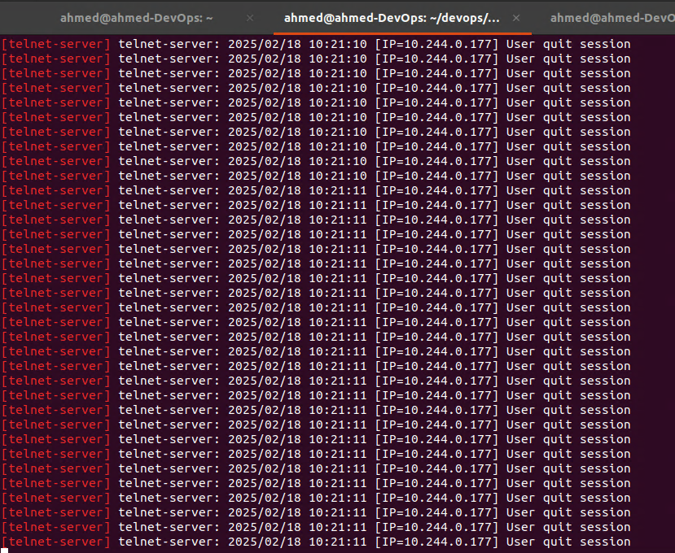

- Part 1: https://ahmouden.com/projects/devops-homelab-part-1
- Part 2: https://ahmouden.com/projects/devops-homelab-part-2
- Part 3: You are here now.

Part 3 will cover the following:
- Observability
- Troubleshooting

# 9 - Observability

Observability is the ability to measure a system's current state based on the data it generates, like metrics, logs, and traces.

Observability is an attribute of a system. Any application worthy of production should be observable.

The main goal of observing a system is to know what it is doing internally by analyzing system outputs like metrics, traces, and logs.


**Metrics** is data over time that provide key insights into an application's **health** abd/or **performance**. 

**Traces** track a request as it traverses different services, to provide a holistic view.

**Logs** provide a historical audit trail of errors or events that can be used for forensics and incident response.

You need to collect this data, then monitor it and alert someone when there is unexpected behavior.

It is best to monitor every application or service of a distributed microservices architecture, so you can know the state of a service and how it is interacting with other services.

In our case, we'll observe the telnet-server application with metrics, monitoring and alerting.

## Monitoring

Monitoring is actions taken to record, analyze, and alert on predefined metrics to understand the current state of a system.

In order to measure a system's state, we need applications that can be publish metrics that tell a story about what the system is doing at any given time.

The state of a system can either be *normal* or *abnormal* (something is wrong). We can differentiate between the two using metrics by setting thresholds around the metrics to create a baseline of what is a normal state. For example, the normal state for a web application is to return the HTTP `200` status code when requesting the home page, and when the server is doing it returns another status code, which means something is wrong and we need to alert someone to bring the application back online.

Every company needs **robust** monitoring and alerting systems set in place because that is the way to quickly identify the root cause of problems and to resolve them.

Just like in medicine, when a problem occurs in a system we need to look for the symptoms and their causes. We can do that be answering two questions: What? for the symptom and Why? for the reasons behind the symptoms.

We can answer the What? question by monitoring the system state. And for the Why? question to reach the resons behind the problem we can use logs, and traces. But correlating the symptom with the cause is not a straightforward process, because it largley depends on the quality of data the system is publishing.

It is important to focus on data that can help you answer the two questions What? and Why? when designing metrics and monitoring solutions for your application and infrastructure.

## Monitoring the Sample Application


The `telnet-server` application has two endpoints, one for the clients, and the other is an HHTP endpoint that serves the application metrics. 

We are intrested in collecting data related to the user experience, like connection errors and traffic.

The monitoring stack will consist of three main monitoring applications and a traffic simulation application. The monitoring application are Prometheus for metrics collection, Alertmanager to handle alerts, and Grafana to create dashboards using data coming from Prometheus. The traffic simulator is *bbs-warrior* it can simulate client connections to the server.

## Installing the Monitoring Stack

The application's manifest files are located inside the `monitoring/` directory. We need to tell kubectl to simply apply them and the monitoring stack will get deployed in a separate namespace `monitoring`:

```sh
kubectl apply -R -f monitoring/
```

> [!TIP]
> To force `kubectl` to apply a specific manifest first, change the manifest's name to add the prefix `00_`. If you want another manifest to get applied second, preifx its name with `01_`, etc

The `00_` prefix was used with the manifest file that creates the `monitoring` namespace because everything else depends that the namespace is already created.

## Verifying the Installation

All the monitoring applications have a `NodePort` service attached to them to be ablt to access them outside the cluster.

```sh
ahmed@ahmed-DevOps:~/devops/telnet-server$ kubectl get service --namespace=monitoring
NAME                   TYPE       CLUSTER-IP      EXTERNAL-IP   PORT(S)          AGE
alertmanager-service   NodePort   10.105.31.171   <none>        9093:31985/TCP   2d23h
grafana-service        NodePort   10.98.3.72      <none>        3000:32076/TCP   2d23h
prometheus-service     NodePort   10.106.89.152   <none>        9090:30496/TCP   2d23h
```

The services are accessible outside the Kubernetes cluster, which means they are accessible inside the minikube VM. So we need to get the minikube's IP and use the service Port to access the application.

### Grafana

We can access Grafana through the minikube's IP and port `32076`:

```sh
ahmed@ahmed-DevOps:~/devops/telnet-server$ kubectl get service --namespace monitoring
NAME                   TYPE       CLUSTER-IP      EXTERNAL-IP   PORT(S)          AGE
alertmanager-service   NodePort   10.105.31.171   <none>        9093:31985/TCP   3d3h
grafana-service        NodePort   10.98.3.72      <none>        3000:32076/TCP   3d3h
prometheus-service     NodePort   10.106.89.152   <none>        9090:30496/TCP   3d3h
ahmed@ahmed-DevOps:~/devops/telnet-server$ minikube ip
192.168.59.100
```

So the Grafana application can be found in:

> http://192.168.59.100:32076/


We can also tell minikube to access the grafana service using the default browser:

```sh
ahmed@ahmed-DevOps:~/devops/telnet-server$ minikube -n monitoring service grafana-service
|------------|-----------------|-------------|-----------------------------|
| NAMESPACE  |      NAME       | TARGET PORT |             URL             |
|------------|-----------------|-------------|-----------------------------|
| monitoring | grafana-service |        3000 | http://192.168.59.100:32076 |
|------------|-----------------|-------------|-----------------------------|
  Opening service monitoring/grafana-service in default browser...
ahmed@ahmed-DevOps:~/devops/telnet-server$ 
```

And the browser will open with the Grafana dashboard, which means it was installed correctly:


### Alertmanager 

```sh
ahmed@ahmed-DevOps:~$ minikube -n monitoring service alertmanager-service
|------------|----------------------|-------------------|-----------------------------|
| NAMESPACE  |         NAME         |    TARGET PORT    |             URL             |
|------------|----------------------|-------------------|-----------------------------|
| monitoring | alertmanager-service | alertmanager/9093 | http://192.168.59.100:31985 |
|------------|----------------------|-------------------|-----------------------------|
  Opening service monitoring/alertmanager-service in default browser...
ahmed@ahmed-DevOps:~$
```

And here is the Alertmanager dashboard:


### Prometheus

Same thing for Prometheus

```sh
ahmed@ahmed-DevOps:~$ minikube -n monitoring service prometheus-service
|------------|--------------------|-------------|-----------------------------|
| NAMESPACE  |        NAME        | TARGET PORT |             URL             |
|------------|--------------------|-------------|-----------------------------|
| monitoring | prometheus-service |        9090 | http://192.168.59.100:30496 |
|------------|--------------------|-------------|-----------------------------|
  Opening service monitoring/prometheus-service in default browser...
ahmed@ahmed-DevOps:~$
```

And the dashboard:


### bbs-warrior

bbs-warrior is a Kubernetes CronJob that runs a recurring job every minute. Every minute Kubernetes will create a container that runs a Go program that creates a random number of connections and errors to the telnet-server application. It also sends a random number of commands to the telnet-server to mimic typical user activity.

To make sure bbs-warrior is active, let's check the CronJobs running in the Kubernetes cluster:

```sh
ahmed@ahmed-DevOps:~/devops/monitoring/bbs-warrior$ kubectl get cronjobs -l app=bbs-warrior
NAME          SCHEDULE      TIMEZONE   SUSPEND   ACTIVE   LAST SCHEDULE   AGE
bbs-warrior   */1 * * * *   <none>     False     0        49s             4d17h
ahmed@ahmed-DevOps:~/devops/monitoring/bbs-warrior$ 
```

The telnet-server logs indicate that there are multiple connections to the server, so bbs-warrior is working.



The CronJob creates a Pod to execute the Go program, so let's check if there are any Pods in there related to bbs-warrior:

```sh
ahmed@ahmed-DevOps:~/devops/monitoring/bbs-warrior$ kubectl get pods -l app=bbs-warrior
NAME                         READY   STATUS              RESTARTS   AGE
bbs-warrior-28997902-9nsr4   0/1     Completed           0          80s
bbs-warrior-28997903-bjh7x   0/1     ContainerCreating   0          20s
ahmed@ahmed-DevOps:~/devops/monitoring/bbs-warrior$
```

What a lucky timing to get the pods! We can see two pods, one completed and the other getting created and a difference of **1 minute** between the two, which the same duration of the CronJob!

## Metrics

The monitoring stack is installed and verified. Now we need to collect metrics to help us improve the user experience. To do that, we need to use a common pattern for the metrics to align all our applications so everyone who is looking at the metrics is on the same page.

A common metric pattern is called **Golden Signals** (coined by Google). This pattern tracks a subset of metrics like errors and traffic and provides a common language to understand the metrics.

### Golden Signals

The Golden Signals are **four** metrics that help us understand the health of a microservice:

- **Latency**: The time it takes for a service to process a request
- **Traffic**: The number of request an application is receiving
- **Errors**: The number of errors an application is reporting (`500`s for example)
- **Saturation**: How much full the service is. For instance, how much CPU usage it takes to the host to become slow or unresponsive

If you have no idea what to monitor in an application, start with The Golden Signals. 

The telnet-server is a microservice, and we want to measure its health.

### Adjusting the Monitoring Pattern

Sometimes we can't always follow the pattern. In our case, we will not track the latency of the requests made to the telnet-server because typical user activity consists of connecting to the server and running multiple commands in the span of a few seconds or minutes.

### RED and USE

RED is another common metric. It focuses more on the health of the microservice:

- **Rate**: The number of requests per second a service is receiving
- **Error**: The number of failed requests per second that the service encounters 
- **Duration**: The amount of times it takes to serve a request or how long it takes to return the data the client requested

USE is yet another metric pattern, but it focuses more on the underlying system to uncover performance issues:

- **Utilization**: The average time the resource (eg. a disk drive at 85 percent usage) is busy doing work
- **Saturation**: Extra work the system could not get to, for instance a busy host that is queueing up connections to serve traffic 
- **Errors**: The number of errors (network collisions, disk IO errors) a system is having

# 10 - Troubleshooting Hosts

Monitoring, instrumentation, and tracing are important to determine the health of your applications and hosts. But sometimes they are not enough and you would need to do some digging to find the root cause of the problems through **troublershooting** and **debugging**.

- **Troubleshooting**: is the process of analyzing the system and rooting out potential causes of trouble
- **Debugging**: is the process of discovering the cause of trouble and possibly implementing steps to fix it.

Debugging is a subset of troubleshooting.

We'll learn about the most common performance problems and issues on a Linux host. We'll learn about the symptomps of the problems and how to diagonse them.

## A Primer to Troubleshooting and Debugging

Troubleshooting and debugging are not an exact sience, but they are like being a detective following clues and forming hypothesises into you find the root cause of the problem.

- Don't jump into conclusions when troubleshooting a problem. Be methodical and build upon the knowledge you have gained fact by fact.
- You need to understand how the system you are troubleshooting is interacting with the other systems.
- Have your toolkit on every host by using automation to make them available there.
- Keep a journal of all problems, symptoms, and fixes so you don't forget about them in the future.
- Ask for help when the problem is having a higher impact than you can handle.

## Scenario: High Load Average

 